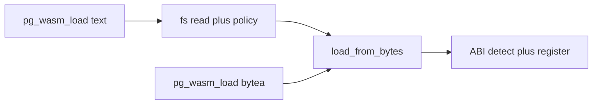

# pg_wasm Extension Implementation Plan

## Current state

- Workspace with [Cargo.toml](Cargo.toml) and [pg_wasm/Cargo.toml](pg_wasm/Cargo.toml); pgrx 0.17.0; PG 13–18 feature flags already present.
- [pg_wasm/src/lib.rs](pg_wasm/src/lib.rs) is a minimal pgrx extension with a single `hello_pg_wasm` stub.

---

## Architecture overview

```mermaid
flowchart TB
  subgraph load [Load path]
    Input[path or bytea]
    Input --> Bytes[WASM bytes]
    Bytes --> Detect[ABI detection]
    Detect --> Runtime[Choose runtime]
    Runtime --> Wasmer[wasmer]
    Runtime --> Wasmtime[wasmtime]
    Runtime --> Extism[extism]
  end
  subgraph registry [Extension state]
    Reg[Module registry]
    Reg --> Trampoline[Single trampoline fn]
    Trampoline --> PG[pg_proc entries]
  end
  subgraph call [Invocation]
    Query[SQL query]
    Query --> UDF["<module>_<func>"]
    UDF --> Trampoline
    Trampoline --> Lookup[Lookup by fn_oid]
    Lookup --> Invoke[Invoke WASM]
    Invoke --> Map[PG type mapping]
    Map --> Result[Return to PG]
  end
```


- **Single trampoline:** All WASM-backed UDFs point to one C/pgrx symbol. The trampoline uses `fcinfo->flinfo->fn_oid` to look up `(module_id, function_name)` in extension state and then calls the appropriate WASM export.
- **Dynamic registration:** When a module is loaded, the extension creates one `pg_proc` row per exported function (via PostgreSQL’s internal `ProcedureCreate` or equivalent from `pg_sys`), each with the same C symbol and with identity stored in extension state keyed by function Oid. Unload removes these entries and frees runtime resources.

---

## 1. Project layout and dependencies

- **Crates:** Keep `pg_wasm` as the only workspace member; no need to split crates initially.
- **Features (Cargo.toml):**
  - `runtime_wasmer`, `runtime_wasmtime`, `runtime_extism` (default: enable at least one, e.g. `wasmtime` for broad compatibility).
  - Keep existing `pg13`–`pg18` and `pg_test`.
- **Dependencies (optional / feature-gated):**
  - `wasmer` and `wasmtime` for core WASM; `extism` for Extism plugin ABI (extism uses wasmtime internally).
  - For type mapping and WIT: consider `wit-component` / `wit-bindgen` or a minimal custom mapping layer; add `serde_json` for JSONB.
  - Telemetry: `metrics` or similar crate, or a small internal counter/histogram API that can be wired to `pg_stat_`* or shared memory stats later.

---

## 2. ABI detection and multi-runtime support

- **Detection (at load time, before instantiating):**
  - Parse the WASM binary (e.g. `wasmparser` or runtime’s own parser) to read exports and custom sections.
  - **Extism:** Detect Extism plugin ABI (e.g. expected exports or manifest-driven contract). Extism uses a bytes-in/bytes-out interface and specific host imports; if the module imports Extism runtime APIs, treat as Extism.
  - **Component model (WIT):** Detect via component-model custom sections (e.g. `component-type`* / `wit-component` metadata). Prefer wasmtime for components (wasmtime has full component model support).
  - **Core WASM module:** Otherwise treat as classic module; try wasmer or wasmtime. Assume WASI support (or wasmer's WASIX interface).
- **Strategy:** Try in order: Extism → (if not Extism) WIT component → core module. Store detected ABI kind in module metadata for metrics and for choosing the right runtime on each call.
- **Runtime selection:** Config or load-time hint via `options` on `pg_wasm_load` (e.g. optional `runtime: 'wasmtime'|'wasmer'|'extism'`) with a sensible default (e.g. wasmtime). **Load entry points:** primary v1 surface is `**pg_wasm_load(path text, module_name text default null, options jsonb default null)`** (read WASM from disk; see section 8); optional `**pg_wasm_load(wasm bytea, ...)`** for generated or inlined binaries. Both converge on internal `load_from_bytes`. Only compile in runtimes that are enabled by feature flags.

---

## 3. Type mapping (PG ↔ WASM)

- **Scalars:** Map PG `int2/int4/int8`, `float4/float8`, `bool`, `text`/`varchar` to WASM `i32`/`i64`, `f32`/`f64`, `i32`, and pointer/length or a shared buffer convention. Define a small type-mapping table and use it in the trampoline when marshalling `fcinfo` args and return value.
- **Complex types:**
  - **JSONB:** Serialize to JSON bytes (e.g. via pgrx/PG APIs and `serde_json`) and pass to WASM as bytes or string; optionally support WIT “string” or “list u8”. Return value: bytes/string back and parse to JSONB for return.
  - **UDTs (user-defined types):** Map to a WIT record or a canonical form (e.g. JSON or a fixed record). Allow a small DSL or config (e.g. per-module or per-function) to bind a UDT to a WIT record name; default to a generic “record as JSON” if no binding.
- **WIT:** Use WIT definitions (e.g. embedded in component or supplied at load time) to drive layout of arguments and return values for components; for classic modules, maintain an internal “signature” (e.g. from export section) and a small PG↔WASM mapping table.
- **Implementation:** A dedicated `mapping` or `types` module in the extension: PG type Oid → WASM type + marshal/unmarshal; support variadic or overloaded WASM exports only where the chosen ABI allows (e.g. Extism’s single buffer in/out can carry a small descriptor for “which PG types” for polymorphic handling).

---

## 4. Fast startup and execution

- **Module cache:** Keep loaded modules in a registry (see below). Key by module identity (e.g. content hash or user-supplied id) so the same bytea is not recompiled.
- **Reuse instances:** Per backend process, keep one or more instantiated modules (and optionally one instance per session or per transaction, depending on isolation requirements). Reuse the same instance for repeated calls to the same module’s functions to avoid instantiation overhead.
- **Compilation:** Use runtimes’ “compile once, instantiate many” where supported (wasmtime/wasmer both support this). Store compiled `Module` (or equivalent) in the registry and create `Instance`s from it as needed.
- **Trampoline:** Keep the trampoline thin: Oid → (module, func) lookup, then marshal args, call WASM, unmarshal return. Avoid per-call allocations where possible (e.g. reuse buffers in a per-call or per-session context).

---

## 5. PostgreSQL version support (PG 13–18)

- Rely on existing pgrx feature flags (`pg13`–`pg18`). Use `#[cfg(feature = "pg13")]` etc. only where API differences between PG versions require it (pgrx usually abstracts this).
- Test matrix: run `cargo pgrx test` with each feature to ensure no regressions. Prefer pgrx’s versioned APIs over raw `pg_sys` where available.

---

## 6. Host interaction (WASI) and configurable policies

- **WASI / host functions:** Enable WASI or host imports only when allowed by policy. Policies: extension-wide GUCs (e.g. `pg_wasm.allow_wasi`, `pg_wasm.allow_`*) and per-module options at load time (e.g. `options = '{"allow_wasi": true}'`).
- **Policy model:** Define a small policy struct (e.g. allow filesystem read/write, network, env, etc.) and apply it when creating the runtime environment (e.g. wasmtime’s WASI ctx, or wasmer’s WASI imports). Per-module policy overrides or narrows extension defaults.
- **Configuration after load:** Support “reconfigure” for a loaded module (e.g. `pg_wasm.reconfigure_module(module_id, options)`). Apply new policy and, if the runtime supports it, update limits or host bindings without full reload. Optional init/destroy/reconfig hooks (see below) run when appropriate.

---

## 7. Metrics and telemetry

- **Counters/timings:** Per module and per function: invocation count, total/cumulative time, error count. Optionally histogram of latency (e.g. buckets).
- **Resource:** Track memory (e.g. linear memory size or host-reported usage) per module; optionally CPU (if available from runtime).
- **Storage:** Either in shared memory (so all backends see the same stats) or in process-local memory with a way to expose via system views. Prefer shared memory for “extension-wide” metrics so `pg_wasm_modules` (or similar) can show usage.
- **Exposure:** System views (e.g. `pg_wasm_modules`, `pg_wasm_functions`, `pg_wasm_stats`) that read from this state. Optionally GUC to enable/disable collection to avoid overhead when not needed.

---

## 8. Module lifecycle: load, unload, identity, and views

- **Unique identity:** Each loaded module has a stable id (e.g. UUID or bigint from a sequence), plus optional user-defined name. Identity is used in the function naming `<module_name>_<export_name>` and in all APIs (unload, reconfigure, metrics).
- **Load (API):**
  - `**pg_wasm_load(path text, module_name text default null, options jsonb default null)`** — primary v1 surface. The backend reads the file (extension-side `std::fs::read` with caps and policy; do **not** rely on `pg_read_binary_file` for arbitrary absolute paths). Users should not need SQL tricks to get WASM into `bytea`.
  - `**pg_wasm_load(wasm bytea, module_name text default null, options jsonb default null)`** — same semantics for callers that already have bytes in memory.
  - Both overloads call a single internal `**load_from_bytes(bytes, module_name, options)`**; steps after bytes are available: ABI detection, compile + instantiate, register exports as UDFs (trampoline + catalog), store in registry.
- **Path resolution:** PostgreSQL does not define a portable “current directory” for backends. **Relative paths** resolve against a GUC base directory (e.g. `**pg_wasm.module_path`** — single directory; document that it must be set when using relative paths). For a later iteration, `**pg_wasm.module_search_path`** (comma-separated directories, try in order) is an optional ergonomic upgrade. **Absolute paths:** normalize (e.g. canonicalize), then enforce allowed-prefix rules (section 14).
- **Read limits:** Enforce `**pg_wasm.max_module_bytes`** before and after read to cap DoS.
- **Flow:**




- **Unload:** `pg_wasm_unload(module_id)`: drop `pg_proc` entries for that module’s functions (via `ProcedureDrop` or equivalent), remove from registry, drop instances and compiled modules, run optional destroy hook. Ensure no references remain (e.g. revoke or document that callers must not be in use).
- **Views:** At least one view listing loaded modules (id, name, ABI, runtime, config, policy summary). Optionally a view of exported functions (module_id, function_name, PG function Oid). These read from the registry (and, if metrics are in shared memory, join to stats).

---

## 9. Module-wide config and optional hooks

- **Config at load:** Accept a key-value or JSON options (e.g. `max_memory`, `timeout`, policy flags). Stored with the module and applied when creating instances or host bindings.
- **Reset/reconfig:** `pg_wasm.reconfigure_module(module_id, options)` to update config and re-apply policy/limits; optional “reconfig” hook (see below).
- **Optional hooks (constructor/destructor style):** Allow the user to specify optional export names, e.g. `on_load`, `on_unload`, `on_reconfigure`. When loading: after instantiation, if `on_load` exists, call it (with optional config bytes). On unload: call `on_unload` before tearing down. On reconfigure: call `on_reconfigure` with new config bytes. These are best-effort (e.g. no return value required) and must not block or violate PG’s execution model.

---

## 10. Memory: shared memory vs process-local and limits

- **PostgreSQL shared memory:** `ShmemAlloc` is no-free; WASM runtimes typically need growable/freeable linear memory. Using shared memory for WASM allocations would require a custom allocator that backs runtime memory from a fixed pool (e.g. a pool in shared memory) and implementing the runtime’s “host memory” or custom allocator API (wasmtime has `Config::with_host_memory()`). This is complex and runtime-specific; recommend **phase 1:** document as future work and use process-local WASM memory with configurable limits.
- **Resource limits:** Extension-level and per-module limits: max linear memory (e.g. pages or bytes), max execution time if the runtime supports it (e.g. wasmtime “epoch” or fuel). Store limits in config and enforce when creating instances or in the trampoline (e.g. set fuel before call, check after). If custom allocator from shared memory is implemented later, the same limits can apply to the pool.

---

## 11. UDF naming, registration, and access control

- **Naming:** Exposed UDFs: `<module_name>_<export_name>` in the extension’s schema (e.g. `pg_wasm` or `public` depending on design). Use a single C trampoline symbol (e.g. `pg_wasm_udf_trampoline`) for all such functions; identity comes from `fn_oid` → (module_id, export_name) in registry.
- **Registration:** When loading a module, for each exported function: build argument and return types (from WIT or from a default mapping), then call PostgreSQL’s internal function that creates a `pg_proc` row (e.g. `ProcedureCreate` in `pg_sys` if exposed, or the same machinery that `CREATE FUNCTION` uses). Ensure the function’s Oid is stored in the registry so the trampoline can resolve it.
- **Access control:** Rely on PostgreSQL’s normal GRANT/REVOKE on the created functions. Recommend: create functions in a dedicated schema (e.g. `pg_wasm`) and document that superuser or a dedicated role should run `pg_wasm_load`; then grant EXECUTE on specific `<module>_<func>` to roles as needed. Optionally a GUC or policy to restrict who can call `pg_wasm_load`/`pg_wasm_unload` (e.g. only superuser or a designated role).

---

## 12. Implementation order (suggested)

Serial steps below match the plan frontmatter `todos` (same order); complete one before starting the next.

1. **Core layout:** Split [pg_wasm/src/lib.rs](pg_wasm/src/lib.rs) into modules: `runtime` (trait + one backend, e.g. wasmtime), `registry`, `mapping`, `trampoline`, `config`.
2. **Registry and trampoline:** In-memory registry mapping `fn_oid` → (module handle, export name). Implement the single trampoline function and register it with pgrx; manually test by having the trampoline return a constant (no WASM yet).
3. **Dynamic UDF registration:** Implement creating one `pg_proc` row per export (using pgrx/pg_sys) and unregistration on unload. Test load/unload and that `SELECT module_func(...)` hits the trampoline and resolves correctly.
4. **One runtime (e.g. wasmtime):** Implement `**load_from_bytes`** first, then `**pg_wasm_load(text)`** that reads the file (GUCs + policy) and delegates to it, then the `**bytea`** overload. Wire load → compile → instantiate → call from trampoline with simple types (e.g. i32 → i32). Add basic type mapping for scalars. Tests can use fixture `.wasm` files under a configured `module_path` without embedding `bytea` in SQL.
5. **ABI detection:** Add detection (Extism vs component vs core) and branch to the right runtime or loading path.
6. **Type mapping:** Extend to text, JSONB, and a simple UDT→bytes or UDT→JSON mapping; optionally WIT-driven for components.
7. **Policies and WASI:** Add GUCs and per-module policy; enable WASI only when allowed; add reconfigure.
8. **Metrics and views:** Add counters/timings, store in shared or process memory, and expose `pg_wasm`_* views.
9. **Optional hooks:** on_load, on_unload, on_reconfigure.
10. **Resource limits:** Per-module and global memory/execution limits.
11. **Additional runtimes:** Feature-gated wasmer and extism backends; runtime selection in load options.

---

## 13. Risks and mitigations

- **ABI detection ambiguity:** Some modules may match more than one ABI; define a strict order (e.g. Extism first) and document it. Allow override via load options.
- **pgrx/pg_sys stability:** `ProcedureCreate` and drop equivalents may differ across PG versions; hide behind a small compatibility layer and test each pg13–pg18.
- **Memory in shared memory:** Custom allocator for runtimes is non-trivial; defer and use process-local memory with limits in v1.

---

## 14. Security and access control (summary)

- **Loading/unloading:** Restrict to superuser or a role granted a dedicated “wasm loader” privilege (e.g. via a GUC or a separate extension role).
- **Execution:** Normal PG EXECUTE on `<module>_<func>`; recommend schema `pg_wasm` and explicit GRANTs.
- **Host interaction:** Strict default (WASI disabled); enable only via policy and document that enabling filesystem/network increases risk.
- **Input validation:** Validate WASM bytes (size limit, basic magic/version) before passing to runtimes to avoid DoS.
- **Path-based load:** Restrict who may call `pg_wasm_load` with a path (superuser or dedicated loader role; document clearly). GUCs: `**pg_wasm.allow_load_from_file`** (must be on for path-based load; default conservative, e.g. off), `**pg_wasm.allowed_path_prefixes`** (comma-separated; after canonicalization, the resolved path must be under one prefix — if empty, fall back to a documented rule such as only under `**pg_wasm.module_path`** or data-directory subtree). `**pg_wasm.max_module_bytes`** applies to reads from disk as well. **Symlinks:** resolve then re-check prefix, or reject symlink final paths — pick one policy and document it.

---

This plan gives a clear path to an initial pg_wasm that meets your feature set, with shared-memory allocation and optional hooks left as incremental improvements after the core is in place.