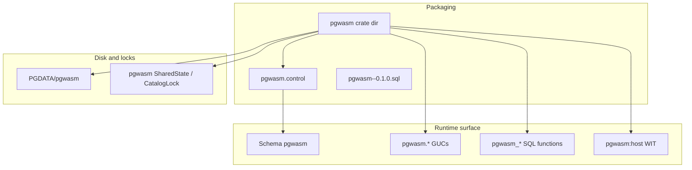

# Full rename to `pgwasm` (extension, schema, GUCs, SQL API, artifacts, WIT)

## Goals

- **PostgreSQL extension name** `pg_wasm` → `**pgwasm`** (`CREATE EXTENSION pgwasm`; `extname`; control + SQL script filenames).
- **Crate / directory** `[pg_wasm/](pg_wasm/)` → `**pgwasm/`** (workspace member, all path references). Git repo rename is out of scope (you handle it).
- **Default schema** `wasm` → `**pgwasm`** (control `schema`, Rust catalog constant, all qualified SQL in tests/docs).
- **GUCs** `pg_wasm.*` → `**pgwasm.*`** (`[pg_wasm/src/guc.rs](pg_wasm/src/guc.rs)` today; moves with crate).
- **SQL function basenames** explicitly prefixed: `**pgwasm_*`** via `#[pg_extern(name = "pgwasm_load")]` (and analogous names for unload, reload, reconfigure, unload_all, SRFs like `pgwasm_modules`, test hooks, `_core_invoke_scalar` → e.g. `pgwasm_core_invoke_scalar`). Call sites become `SELECT pgwasm.pgwasm_load(...)` (schema + basename).
- **Practical remaining renames**
  - On-disk: `[ARTIFACTS_DIRNAME](pg_wasm/src/artifacts.rs)` `pg_wasm` → `**pgwasm`** (`$PGDATA/pgwasm/<module_id>/`).
  - Roles: `wasm_loader` / `wasm_reader` → `**pgwasm_loader**` / `**pgwasm_reader**` (SQL bootstrap + Rust permission strings + regress).
  - Shared memory / LWLock strings → `**pgwasm.***` (`[shmem.rs](pg_wasm/src/shmem.rs)`).
  - Host **WIT** package / import detection: `pg-wasm:host` → `**pgwasm:host`** (or single identifier `pgwasm:host/*`); updates `[host.rs](pg_wasm/src/runtime/host.rs)` generated `bindings::...`, `[pool.rs](pg_wasm/src/runtime/pool.rs)` substring checks, fixture components’ WIT imports, and docs.
  - Anonymous composite prefix `**pg_wasm_tuple_**` → `**pgwasm_tuple_**` (`[wit-mapping.md](docs/wit-mapping.md)`, mapping code).
  - `**proc_reg.rs**`: `$libdir/pg_wasm`, `pg_wasm_udf_trampoline`, and any `prosrc` filters must match the **new library and symbol names** after the crate rename (pgrx naming rules — verify in a build).
- **No migration story**: drop old `pg_wasm--*.sql` upgrade paths or replace with a minimal bootstrap for `pgwasm` only; no `ALTER EXTENSION ... SET SCHEMA` requirement. Anyone with old installs can `DROP EXTENSION` / reinstall.

## Workspace / packaging checklist

| Item                                                                                         | Action                                                                                                                  |
| -------------------------------------------------------------------------------------------- | ----------------------------------------------------------------------------------------------------------------------- |
| `[Cargo.toml](Cargo.toml)` `members`                                                         | `"pgwasm"`                                                                                                              |
| Crate `[Cargo.toml](pg_wasm/Cargo.toml)`                                                     | `[package] name = "pgwasm"` (path becomes `pgwasm/Cargo.toml`)                                                          |
| Control                                                                                      | `pgwasm.control`: `default_version`, `module_pathname` = library name pgrx installs (often `pgwasm`), `schema = pgwasm` |
| SQL files                                                                                    | `pgwasm/sql/pgwasm--0.1.0.sql` (+ versioned upgrades only if you keep them)                                             |
| `[catalog.rs](pg_wasm/src/catalog.rs)` `extension_sql_file!`                                 | Path to new bootstrap SQL                                                                                               |
| `[AGENTS.md](AGENTS.md)`, `[.cursor/rules/pgrx-testing.mdc](.cursor/rules/pgrx-testing.mdc)` | Paths globs, `-p pgwasm`, directory names                                                                               |
| CI / badges                                                                                  | `[README.md](README.md)`: user updates GitHub URLs when repo renames                                                    |
| `.gitignore`                                                                                 | `pgwasm/target/`, workspace file names if any                                                                           |

## Implementation notes

### Single extension schema constant

Same as before: one `pub(crate) const EXTENSION_SCHEMA: &str = "pgwasm"` used for SPI, proc registration schema, and catalog validation (`pg_namespace` / `information_schema` checks).

### SQL API naming

Today `[lib.rs](pg_wasm/src/lib.rs)` exposes short names (`load`, `unload`, …) under the extension schema. After rename, set explicit SQL names so grep and docs stay clear, e.g. `pgwasm_load`, `pgwasm_unload`, `pgwasm_reload`, `pgwasm_reconfigure`, `pgwasm_unload_all`, `pgwasm_modules`, `pgwasm_functions`, … including `[reload.rs](pg_wasm/src/lifecycle/reload.rs)` exports and `[views.rs](pg_wasm/src/views.rs)` `name = "modules"` → `name = "pgwasm_modules"` (and update `[views.rs](pg_wasm/src/views.rs)` embedded SQL that builds view definitions referencing those functions).

### WIT / components

Any component that imports `pg-wasm:host/query` (or log/json) must switch to the new package id and be recompiled. Integration guests (`[tests/http_search_guest](tests/http_search_guest)`, regress fixtures under `[pg_wasm/fixtures](pg_wasm/fixtures)`) need WIT + lockfile updates.

### Optional cleanup

- Internal Rust types like `PgWasmError` can stay for minimal churn, or be renamed to `PgwasmError` in a follow-up — **not required** for the user-facing `pgwasm` branding.

## Verification

Same commands as `[AGENTS.md](AGENTS.md)`, with `**-p pgwasm`** and regress run from `**pgwasm/**`.

## Breaking changes (PR summary)

- Extension name, schema, GUC names, SQL function names, roles, artifact directory, host WIT package id, composite type prefix, `.so` / trampoline symbol — all incompatible with previous `pg_wasm` / `wasm` / `pg-wasm:host` installs.

