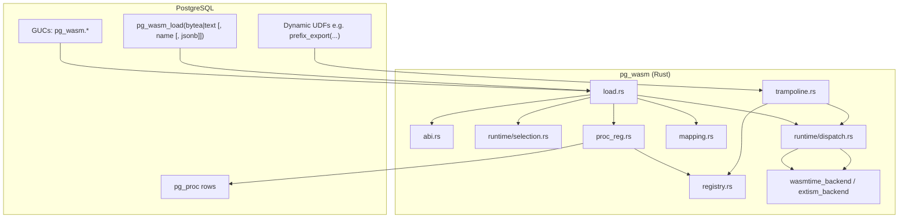
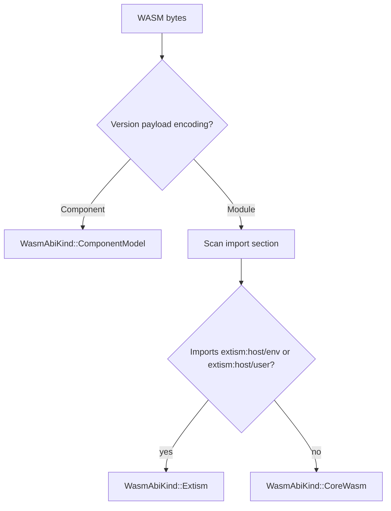
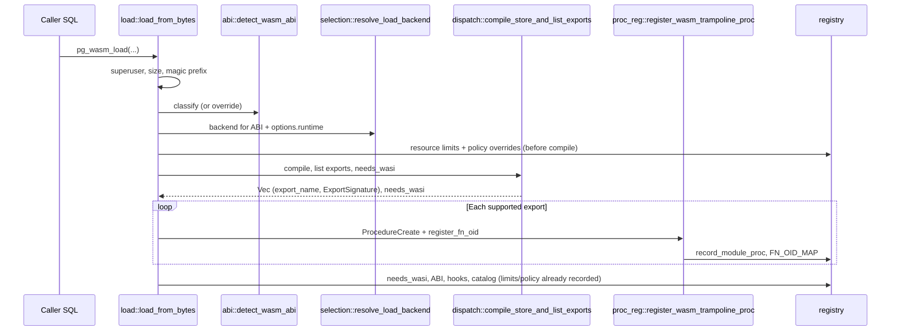
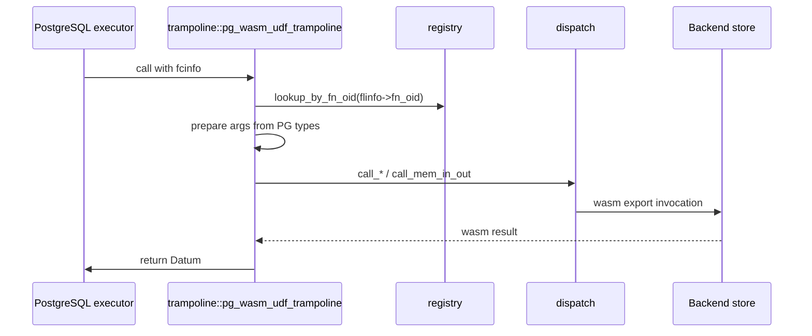

# pg_wasm architecture

This document describes how the **pg_wasm** PostgreSQL extension is organized, how WASM modules are loaded and executed, and where to change behavior when contributing. It targets engineers working in this repository.

## Purpose

pg_wasm loads WebAssembly binaries into a PostgreSQL backend process, exposes selected WASM exports as ordinary SQL functions, and routes each call through a single C entry point (the **trampoline**) into a pluggable **runtime backend** (**Wasmtime** for core modules and components, or **Extism** for the Extism plugin ABI, depending on build features and module ABI). Extism embeds its own Wasmtime stack (see **Wasmtime versions** below).

## Repository layout

| Path | Role |
|------|------|
| `pg_wasm/` | The extension crate: Rust library (`cdylib` + `lib`), `pgrx` integration, SQL/control files |
| `pg_wasm/src/lib.rs` | `#[pg_extern]` SQL surface (`pg_wasm_load`, unload, reconfigure, tests) |
| `pg_wasm/pg_wasm.control` | Extension metadata (`module_pathname = 'pg_wasm'` → `$libdir/pg_wasm`) |
| `Cargo.toml` (workspace) | Shared dependency versions; workspace is currently a single member `pg_wasm` |

The extension is built with [pgrx](https://github.com/pgcentralfoundation/pgrx): Rust code links as a PostgreSQL loadable module and registers functions with the server.

## High-level architecture

**Idea:** one shared trampoline symbol is referenced by many `pg_proc` rows; the **function OID** selects which module and WASM export to run via an in-memory map.

## Source modules (Rust)

| Module | Responsibility |
|--------|----------------|
| `abi` | Classify WASM bytes as `CoreWasm`, `ComponentModel`, or `Extism`; optional JSON override |
| `config` | Parse `pg_wasm_load` / `pg_wasm_reconfigure_module` JSON: `runtime`, `abi`, `exports`, hooks, policy, resource limits |
| `guc` | Define and read `pg_wasm.*` settings (paths, size limits, WASI policy, metrics, fuel, memory pages) |
| `load` | Orchestrate load/unload/reconfigure: checks, ABI, backend choice, compile, UDF registration, lifecycle hooks |
| `mapping` | SQL type names ↔ `Oid` and `PgWasmTypeKind`; `exports` hints for text/bytea/jsonb-style signatures |
| `metrics` | Per-export invocation counters, errors, timings; guest memory sampling hooks for introspection |
| `proc_reg` | `ProcedureCreate` / `RemoveFunctionById`, extension dependency for dynamic `pg_proc` rows |
| `registry` | Process-local `ModuleId`, `fn_oid → RegisteredFunction`, policy, WASI flags, catalog entries |
| `runtime/dispatch` | Match on `ModuleExecutionBackend` and forward compile/call/teardown |
| `runtime/selection` | Map detected ABI + `options.runtime` to Wasmtime or Extism |
| `trampoline` | `pg_wasm_udf_trampoline`: `fcinfo` → registry → argument marshaling → dispatch → datum return |
| `views` | Table functions `pg_wasm_modules()`, `pg_wasm_functions()`, `pg_wasm_stats()` |

Optional backend files are compiled only when the corresponding Cargo features are enabled.

## ABI detection

Detection is **parse-only** (via `wasmparser`): no full compile is required to classify bytes.

Rules in code:

1. If the binary is a **component** (`Encoding::Component`), classify as **component model**.
2. Otherwise scan **import** entries: any import module named `extism:host/env` or `extism:host/user` ⇒ **Extism** plugin ABI.
3. Else **core** module.

Callers may override detection with load options, e.g. `"abi": "core"` / `"extism"` / `"component"` (see `abi::parse_abi_override`).

## Runtime selection

`runtime/selection::resolve_load_backend` ties **ABI** and optional `options.runtime` to a concrete `ModuleExecutionBackend`:

| ABI | Constraints |
|-----|-------------|
| **ComponentModel** | Requires **Wasmtime** (and the `runtime-wasmtime` feature). `runtime` may be `"wasmtime"` or `"auto"`. |
| **Extism** | Requires **Extism** backend (`runtime-extism`). |
| **CoreWasm** | `runtime`: `"auto"` picks Wasmtime if enabled, otherwise Extism; or `"wasmtime"` / `"extism"` explicitly (`"extism"` is rejected for plain core modules unless you override `abi`). |

The chosen backend is stored per module in `registry` and used for every invocation and for `remove_compiled_module` on unload.

## Load pipeline

Important details:

- **Superuser** is required for load, unload, reconfigure, and path-based load.
- **WASI:** if the module needs WASI, effective policy (GUCs merged with per-module overrides) must allow it or load fails after cleanup.
- **Extism:** `extism_backend` builds an Extism `Manifest` using the same effective **fuel**, **memory page cap**, **network** (`allowed_hosts`), and **WASI preopens** (`allowed_paths` from `pg_wasm.module_path`) as the direct Wasmtime path, where Extism’s manifest supports them. Per-process **Wasmtime `Config`** (e.g. Cranelift flags in `WasmtimeBackend::empty`) applies only to the direct Wasmtime engine until Extism’s dependency aligns with the workspace Wasmtime semver (see below). **WASI environment inheritance** (`allow_env`) is enforced for Wasmtime’s WASI builders; Extism’s internal `wasi-common` path does not mirror that knob. **`pg_wasm_reconfigure_module`** updates registry limits/policy for Wasmtime immediately on the next instantiate; for Extism, fuel and manifest options are fixed at **compile** time—reload the module to pick up new limits.
- **Exports:** only signatures the stack understands are registered (scalar int/float/bool and buffer-style text/bytea/jsonb when described via `exports` in JSON). Empty export list ⇒ load error.

## Function registration and PostgreSQL catalog

Dynamic SQL functions are created with PostgreSQL’s **`ProcedureCreate`** (wrapped in `proc_reg.rs`), not with a static `CREATE FUNCTION` in the extension SQL file for each export.

- **`prosrc`** is the fixed C symbol name: `pg_wasm_udf_trampoline` (`TRAMPOLINE_PG_SYMBOL`).
- **`probin`** is `$libdir/pg_wasm` (the extension’s shared library).
- **Language** is `c`, **strict** UDFs, volatile / parallel unsafe—matching typical untrusted procedural behavior.
- Immediately after creation, the new **`pg_proc.oid`** is associated with `RegisteredFunction` in `registry::register_fn_oid`.

When registration happens outside `CREATE EXTENSION`, the code records an **extension dependency** (`recordDependencyOn` with `DEPENDENCY_EXTENSION`) so `DROP EXTENSION pg_wasm` can drop dependent objects consistently (see tests for `pg_depend`).

## Invocation path (SELECT …)

The trampoline:

1. Reads **`fn_oid`** from `FunctionCallInfo` / `FmgrInfo`.
2. Looks up **`RegisteredFunction`** (module id, export name, `ExportSignature`, metrics handle).
3. Builds a **`WasmInvocation`** enum case from SQL arguments (scalar vs buffer I/O).
4. Calls **`dispatch`** with the module’s stored **`ModuleExecutionBackend`**.
5. Converts the result back to a **Datum** (including UTF-8 validation for `text` and JSON parse for `jsonb` returns).

Wasm execution is run inside **`catch_unwind`**; panics are turned into SQL errors, with metrics updated on success/failure paths.

## Mapping: SQL types and WASM

`mapping.rs` defines how PostgreSQL types correspond to WASM calling conventions:

- Scalars map to `i32` / `i64` / `f32` / `f64` / bool-style returns as supported by the trampoline table.
- **Buffer I/O** (`text`, `bytea`, `jsonb`): guest sees pointer/length style interfaces in the runtime backends; the trampoline packs/unpacks bytes.

For exports that are not inferable as simple scalars, callers supply **`options.exports`** at load time: per-export `args` / `returns` (or `return`) as type names or Oids, optional `wit` for future component work.

## Configuration and policy

### GUCs (`guc.rs`)

Examples: `pg_wasm.max_module_bytes`, `pg_wasm.allow_load_from_file`, `pg_wasm.module_path`, `pg_wasm.allowed_path_prefixes`, `pg_wasm.allow_wasi` and related WASI capability flags, `pg_wasm.collect_metrics`, `pg_wasm.max_memory_pages`, `pg_wasm.fuel_per_invocation`.

### Load JSON (`config.rs`)

- **`runtime`**, **`abi`**, **`exports`**, **`hooks`** (`on_load`, `on_unload`, `on_reconfigure` export names).
- **Policy overrides** and **resource limits** merged with GUCs; per-module values can only **narrow** what GUCs allow (`effective_host_policy`).

Lifecycle hooks receive config blobs via the backend’s `call_lifecycle_hook` path from `dispatch`.

## Introspection (SQL table functions)

Defined in `views.rs`, backed by **`registry`** and **metrics**:

| Function | Contents |
|----------|----------|
| `pg_wasm_modules()` | Per-module id, prefix name, ABI label, runtime, WASI flag, policy JSON, memory peak, aggregated stats |
| `pg_wasm_functions()` | SQL function name, WASM export, `fn_oid` |
| `pg_wasm_stats()` | Per-export invocations, errors, timings (**this backend process only**) |

## Build features

The crate **must** enable at least one of:

- `runtime-wasmtime` (default in `pg_wasm/Cargo.toml`)
- `runtime-extism`

PostgreSQL major version is selected via `pg13` … `pg18` features on the `pg_wasm` crate. The workspace `wasmtime` dependency enables **component model** support for the direct Wasmtime backend.

### Wasmtime versions (Extism vs direct)

The **Extism** crate pins an older **Wasmtime** release than the workspace `wasmtime` used by `wasmtime_backend`. The binary therefore links **two** Wasmtime versions until upstream aligns them or you use a `[patch.crates-io]` override. Extism does not accept an external `Engine` instance; each `CompiledPlugin` owns its engine. `PluginBuilder::with_wasmtime_config` is only useful once types share the same Wasmtime semver as Extism.

## Mental model for contributors

1. **Adding a new SQL-visible function:** usually `#[pg_extern]` in `lib.rs` or `views.rs`, following pgrx patterns.
2. **Changing how modules load:** `load.rs`, `config.rs`, and possibly `abi.rs` / `selection.rs`.
3. **New WASM calling conventions or types:** `mapping.rs`, then `trampoline.rs` (argument/return marshaling), then each backend’s `compile_store_and_list_exports` and `call_*` implementations, plus `dispatch.rs` wiring.
4. **Engine-specific behavior:** `runtime/wasmtime_backend.rs` or `extism_backend.rs`; keep `dispatch.rs` as a thin match to avoid cross-crate leakage from the trampoline.
5. **Security / policy:** `guc.rs`, `config::PolicyOverrides`, and checks in `load.rs` / backends for WASI and host imports.

## Related reading in-tree

- Module-level `//!` comments in `abi.rs`, `load.rs`, `proc_reg.rs`, `trampoline.rs`, and `views.rs` tie behavior to the internal plan sections they reference.
- `pg_wasm/src/lib.rs` `#[cfg(any(test, feature = "pg_test"))]` test module demonstrates end-to-end SPI usage: load hex-encoded fixtures, call generated function names, assert metrics and `pg_depend`.
