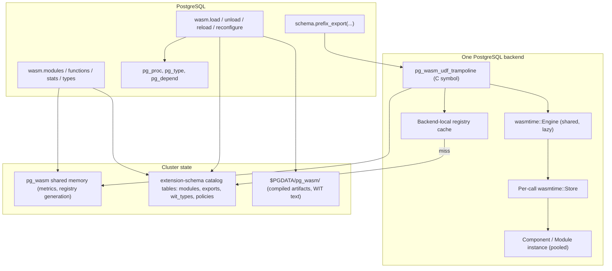
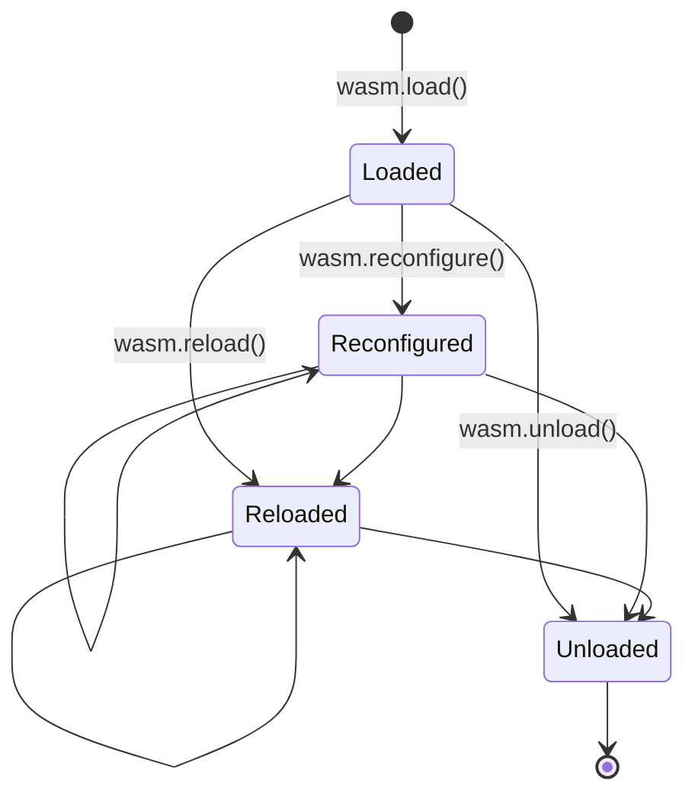
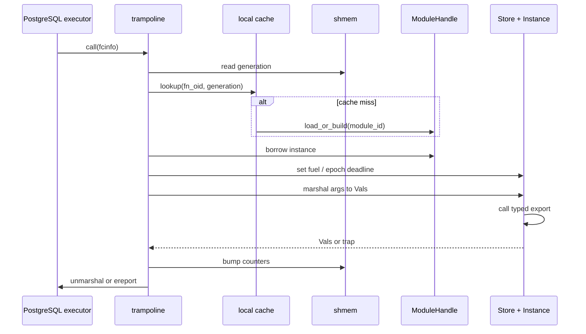

# pg_wasm architecture

This document is the **v2 architectural design** for `pg_wasm`, a PostgreSQL
extension that binds WebAssembly modules and components to SQL-visible
functions. It is written for engineers contributing to the extension and for
operators who need to reason about isolation, resource control, and
introspection.

The implementation plan that materializes this design lives at
[`.cursor/plans/pg_wasm_extension_implementation_v2.plan.md`](../.cursor/plans/pg_wasm_extension_implementation_v2.plan.md).

SQL objects live in the extension schema (`wasm` by default, from
`pg_wasm.control`); configuration parameters keep the `pg_wasm.*` prefix.

---

## 1. Goals and non-goals

### 1.1 Goals

- **Load WASM once, call many times.** Pay compilation and component
  instantiation cost at module-load time so that per-invocation cost is close
  to a native C UDF plus the cost of marshaling arguments.
- **First-class WIT / Component Model.** Components with WIT worlds are the
  primary surface. Complex types (records, variants, enums, flags, lists,
  options, results, tuples) are mapped to PostgreSQL types **automatically**,
  and user-defined WIT types are registered as PostgreSQL composite types
  (UDTs), domains, or enums as appropriate.
- **Core modules supported as a degraded path.** Non-component core modules
  still work, but only with the small set of primitive ABIs that can be
  inferred safely from the module's export signatures.
- **Strong, layered sandbox.** WASI and host capabilities are off by default.
  Administrators enable them through GUCs at extension scope; module loaders
  can further **narrow** (never broaden) those defaults per module.
- **Lifecycle in SQL.** `wasm.load`, `wasm.unload`, `wasm.reload`,
  and `wasm.reconfigure` are first-class SQL functions. Administrative
  state is durable across PostgreSQL restarts.
- **Observability.** Per-module and per-function counters, timings, errors,
  and resource snapshots are visible through SQL views.

### 1.2 Explicit non-goals (for v2)

- **No Extism.** The v1 branch experimented with Extism; v2 intentionally
  targets a single runtime (Wasmtime) to avoid dual-wasmtime linkage and to
  focus WIT support in one place.
- **No in-shared-memory WASM linear memory.** Linear memory lives in the
  executing backend process; sharing guest memory across backends is
  explicitly out of scope.
- **No hot-patching individual exports.** Reload is the unit of change for a
  module's code; reconfigure is the unit of change for policy and limits.

---

## 2. High-level model



The key insights:

1. **One trampoline symbol** backs every `pg_proc` row created by `pg_wasm`.
   The trampoline resolves `(module_id, export)` from `flinfo->fn_oid` and
   dispatches into the runtime.
2. **Persistent catalog + on-disk artifacts** make module identity durable.
   Backends rebuild their local runtime state from catalog tables and cached
   compiled artifacts on demand; nothing in the hot path reads from disk
   except on a cold backend or after a reload.
3. **Shared memory carries only what must be cluster-wide**: a generation
   counter for cache invalidation, per-module/per-function counters, and the
   high-water memory and CPU samples. Everything else is derived state.

---

## 3. Repository layout (target)

```text
pg_wasm/
  Cargo.toml
  pg_wasm.control
  sql/                               # optional versioned SQL: views, upgrades
    pg_wasm--0.2.0.sql
  src/
    lib.rs                           # pgrx entry points + _PG_init
    guc.rs                           # GUC definitions
    errors.rs                        # PgWasmError + conversions
    catalog/                         # durable cluster state
      mod.rs
      schema.rs                      # CREATE TABLE / INDEX DDL
      modules.rs                     # CRUD on extension-schema modules
      exports.rs
      wit_types.rs
      migrations.rs
    artifacts.rs                     # $PGDATA/pg_wasm/ layout and IO
    shmem.rs                         # shared-memory segment + metrics
    registry/                        # process-local cache
      mod.rs
      module_handle.rs               # compiled module + instance pool
      fn_map.rs                      # fn_oid -> (module_id, export)
    config.rs                        # LoadOptions, PolicyOverrides, Limits
    policy.rs                        # resolve(GUCs, overrides) -> EffectivePolicy
    abi.rs                           # Component vs core classifier (wasmparser)
    wit/
      mod.rs
      world.rs                       # parse WIT world / component types
      typing.rs                      # WIT type -> PgType resolver
      udt.rs                         # UDT / enum / domain registration
      codegen.rs                     # Val marshaling helpers
    runtime/
      mod.rs
      engine.rs                      # shared wasmtime::Engine factory
      component.rs                   # component-model compile + instantiate
      core.rs                        # core-module compile + instantiate
      pool.rs                        # per-module instance pool
      limits.rs                      # StoreLimits, fuel, epoch interruption
      wasi.rs                        # WASI p1 and p2 ctx builder from policy
    mapping/
      mod.rs
      scalars.rs                     # i32/i64/f32/f64/bool/string mappings
      composite.rs                   # record / tuple / variant / enum / flags
      list.rs                        # list<T> / option<T> / result<T,E>
      jsonb.rs                       # WIT variant or `json` type -> jsonb
    proc_reg.rs                      # ProcedureCreate / RemoveFunctionById
    trampoline.rs                    # pg_wasm_udf_trampoline C entry point
    lifecycle.rs                     # load / unload / reload / reconfigure
    hooks.rs                         # on_load / on_unload / on_reconfigure
    views.rs                         # SRF table functions
  tests/pg_regress/
    sql/...
    expected/...
tests/                               # workspace integration crate (optional)
  Cargo.toml
  src/lib.rs                         # tokio-postgres client tests
docs/
  architecture.md                    # this document
  guc.md
  wit-mapping.md
```

Everything under `runtime/` and `wit/` is **Wasmtime-specific in v2**. If a
second runtime is ever added, it goes under `runtime/<name>/` behind a feature
flag and must satisfy the same `Runtime` trait (see §8).

---

## 4. Durable state (catalog + artifacts)

### 4.1 Catalog tables

All state that must survive PostgreSQL restarts lives in regular PostgreSQL
tables created in the extension's schema (`pg_wasm`). These tables are owned
by the extension and participate in `DROP EXTENSION ... CASCADE` cleanup.

| Table | Columns (abridged) | Purpose |
|-------|--------------------|---------|
| `wasm.modules` | `module_id bigserial pk`, `name text unique`, `abi text`, `wasm_sha256 bytea`, `artifact_path text`, `wit_world text`, `policy jsonb`, `limits jsonb`, `created_at`, `updated_at`, `generation bigint` | One row per loaded module. `wit_world` stores the textual WIT world interface; `policy`/`limits` are the merged module-scoped overrides. |
| `wasm.exports` | `export_id bigserial pk`, `module_id fk`, `wasm_name text`, `sql_name text`, `signature jsonb`, `fn_oid oid`, `kind text` | One row per SQL-visible export. `signature` is the normalized WIT signature used to rebuild marshaling code. |
| `wasm.wit_types` | `wit_type_id bigserial pk`, `module_id fk`, `wit_name text`, `pg_type_oid oid`, `kind text` (`record`, `variant`, `enum`, `flags`, `domain`), `definition jsonb` | One row per UDT / enum / flags / domain registered in the PG catalog on behalf of this module. |
| `wasm.dependencies` | `module_id fk`, `depends_on_module_id fk` | Used when WIT types are reused across modules (see §6.3). |

All tables are regular (not unlogged, not temporary): we want WAL coverage so
that replication reproduces the extension state.

### 4.2 On-disk artifacts

Compiled artifacts and the original WASM bytes live under
`$PGDATA/pg_wasm/<module_id>/`:

- `module.wasm` — original bytes (for reload-from-catalog and auditing).
- `module.cwasm` — Wasmtime AOT-precompiled artifact
  (`Engine::precompile_component` / `Engine::precompile_module`). Regenerated
  on PostgreSQL upgrade or Wasmtime upgrade if `Engine::is_compatible_with_*`
  rejects the cached file.
- `world.wit` — textual WIT world (pretty-printed) for operator inspection
  and diff.

A backend that sees a `modules` row but no artifact for its process arch
lazily recompiles from `module.wasm` under a per-module load lock. The
extension never trusts catalog rows without a matching checksum on disk.

### 4.3 Shared memory

`pg_wasm` requests a fixed-size shared memory segment in
`shmem_request_hook`. It holds:

- A `u64` **generation counter**. `load`, `unload`, `reload`, and
  `reconfigure` bump the generation under an `LWLock`. Backends compare their
  local cache generation on entry to the trampoline; on mismatch they refresh
  the specific affected module.
- A flat array of **per-export counters** (invocations, errors, total_ns,
  rejected_by_policy, OOM, trap) indexed by `export_id`. Counters are
  `AtomicU64`.
- A flat array of **per-module gauges**: current live instances, peak memory
  pages observed, last error timestamp.

The segment is sized by fixed compile-time constants in `shmem.rs`
(`SHMEM_MODULE_SLOTS = 256`, `SHMEM_EXPORT_SLOTS = 4096`). If more modules
than capacity are loaded, the
excess gets dynamic (non-shared) counters and `wasm.stats` reports
`shared := false` for those rows; this is a degraded mode, not an error.

---

## 5. Module lifecycle



### 5.1 `wasm.load(source, name, options)`

Two overloads converge on `load::from_bytes`:

```sql
wasm.load(wasm bytea,  name text default null, options jsonb default null) returns bigint
wasm.load(path text,   name text default null, options jsonb default null) returns bigint
```

Steps, in order (all inside one explicit transaction block so partial state
is rolled back on failure):

1. **AuthZ.** Require superuser *or* a member of the `pg_wasm_loader` role
   (created by the extension SQL). Path-based load additionally requires
   `pg_wasm.allow_load_from_file = on`.
2. **Read bytes.** For `text` overload, resolve the path against
   `pg_wasm.module_path` and reject if outside `pg_wasm.allowed_path_prefixes`
   after canonicalization. Enforce `pg_wasm.max_module_bytes`.
3. **Validate.** `wasmparser::validate` the whole binary. This rejects
   malformed input before Wasmtime ever sees it.
4. **Classify ABI.** `abi::detect` returns `Component` or `Core`. An
   explicit `options.abi` override is allowed only to force `core` parsing of
   an ambiguous binary; you cannot fake a component.
5. **Resolve WIT.** For components, extract the embedded `component-type`
   custom section via `wit-component::decode` and build a normalized world
   description. For core modules, synthesize a minimal "world" from exports.
6. **Plan types.** For each WIT type reachable from exported functions:
    - If the type is already registered for this module (reload path) and its
      definition is unchanged, reuse the existing `pg_type.oid`.
    - Else, synthesize the PG `CREATE TYPE` / `CREATE DOMAIN` DDL and run it,
      recording rows in `wasm.wit_types` and `recordDependencyOn`.
7. **Plan exports.** Each exported function maps to one `pg_proc` row using
   the trampoline symbol. Function names follow `<prefix>_<export>` where
   `prefix` is `name` or the slugified WIT world name. Reject name
   collisions unless `options.replace_exports = true`.
8. **Policy merge.** `policy::resolve(gucs, overrides)` produces an
   `EffectivePolicy`. Per-module overrides can **only narrow** GUC defaults
   (see §7).
9. **Compile.** Build a shared `wasmtime::Engine` (see §6.1). Call
   `Engine::precompile_component` (or `_module`), persist the `.cwasm` and
   `.wasm` under `$PGDATA/pg_wasm/<module_id>/`, and keep the compiled
   `Component` / `Module` in the process-local registry.
10. **Register procs.** For each planned export call `ProcedureCreate` (via
    `proc_reg.rs`). Record `fn_oid` in `pg_wasm.exports` and the local
    `FN_OID_MAP`.
11. **Hooks.** If the component exports `on-load`, instantiate once and call
    it with the module's config blob (JSON-encoded). Failure aborts the load.
12. **Bump generation.** `shmem::bump_generation(module_id)` so other
    backends refresh on next use.

All of this runs inside one SPI transaction; a failure at any step issues
`ereport(ERROR)` and the SQL-level rollback cleans catalog rows, and a
best-effort cleanup removes on-disk artifacts.

### 5.2 `wasm.unload(module_id)`

1. AuthZ as above.
2. Call `on-unload` hook (best-effort; hook failure is logged, not fatal).
3. `RemoveFunctionById` for every `pg_proc.oid` in `pg_wasm.exports`.
4. Drop registered WIT types. Respect dependencies: if another module
   references a WIT type (see §6.3), refuse the unload unless
   `options.cascade = true`, in which case dependent modules are unloaded
   first.
5. Delete rows from `wasm.exports`, `wasm.wit_types`, `wasm.modules`.
6. Remove `$PGDATA/pg_wasm/<module_id>/`.
7. Bump generation. Backends drop their local `ModuleHandle` on next trampoline
   entry that sees a removed module.

### 5.3 `wasm.reload(module_id, source := null, options := null)`

Reload replaces the module's **bytes** (and therefore exports and WIT types)
without destroying its SQL identity when possible. It runs as unload+load
semantics from the perspective of dependent catalog objects, with two
important differences:

- **Export OIDs are preserved** when the export name, SQL signature, and
  associated WIT types are unchanged. This means `GRANT EXECUTE`s and
  references from views continue to work.
- **WIT type OIDs are preserved** when the normalized WIT definition is
  unchanged. Changed types trigger `ALTER TYPE ... ADD ATTRIBUTE` /
  `DROP ATTRIBUTE` where PostgreSQL supports it; otherwise the reload fails
  with a clear message unless `options.breaking_changes_allowed = true`, in
  which case dependent objects are dropped.

If `source` is `null`, reload reads `module.wasm` from disk (useful for
re-compiling after a Wasmtime upgrade). If provided, the new bytes replace
`module.wasm` atomically (temp-file + rename).

### 5.4 `wasm.reconfigure(module_id, options)`

Reconfigure **does not touch code or types**. It updates `policy` and
`limits` in `wasm.modules`, re-computes the `EffectivePolicy`, and bumps
the generation. The next instantiation in each backend picks up the new
values. If the component exports `on-reconfigure`, it is called with the new
config blob before the generation bump completes.

Fuel and memory limits that are part of the `StoreLimits` take effect on the
next `Store` created. Epoch-based deadline changes take effect immediately
(they are read per call).

---

## 6. Runtime layer (Wasmtime)

### 6.1 Engine

A single `wasmtime::Engine` per backend process is built lazily on first use
from a `wasmtime::Config` configured with the v43 builder-style API:

- `Config::wasm_component_model(true)` — required to compile and instantiate
  components (`wasmtime::component::Component`). The component model is always
  compiled in for v2, and the engine sets this explicitly.
- `Config::epoch_interruption(true)` to enforce wall-clock deadlines. Stores
  are configured with `Store::set_epoch_deadline` before each call and the
  default expiration action (`Store::epoch_deadline_trap`) is kept so a
  missed deadline produces `Trap::Interrupt`.
- `Config::consume_fuel(pg_wasm.fuel_enabled)` to enable deterministic
  per-call fuel budgets. When enabled we call `Store::set_fuel` at the start
  of each invocation and read `Store::get_fuel` afterwards for metrics.
- `Config::cache(None)` — we do not opt into Wasmtime's built-in module
  cache and instead manage our own precompiled artifacts in
  `$PGDATA/pg_wasm/`. (The legacy `Config::cache_config_load_default` method
  from pre-v43 is gone; the `Cache` object is now passed explicitly and
  `None` means "disabled", which is also the default.)
- `Config::parallel_compilation(false)` to keep compile cost predictable
  under PG's process-per-connection model (the default is `true`, which
  pulls in rayon and fights the scheduler during large regression runs).
- **No** `Config::async_support` call. That method was deprecated in
  Wasmtime 43 (`#[doc(hidden)]`, no-op). Store async is now inferred from
  the APIs the store uses; for pg_wasm we stay synchronous and always call
  `Func::call` / `TypedFunc::call` rather than their `_async` variants.

Other settings we deliberately leave at their defaults: `wasm_backtrace`
(on; useful for error reports), `native_unwind_info` (on), SIMD, bulk
memory, reference types, multi-value, and the other stable proposals.

The engine is shared across all modules loaded into a single backend. A
dedicated OS thread drives `Engine::increment_epoch` at
`pg_wasm.epoch_tick_ms` resolution (default 10 ms). The thread is started
once via `std::sync::OnceLock`, holds an `EngineWeak` obtained from
`Engine::weak` (not a strong `Engine` clone), and `EngineWeak::upgrade`s on
each tick so it exits naturally once the last `Engine` reference in the
backend is dropped. It is a plain `std::thread` and holds no Postgres
resources; `Engine::increment_epoch` is signal-safe per its documentation.

### 6.2 Compile and cache

Compilation happens in `wasm.load`. The resulting `Component` (or
`Module`) is stored in two places:

1. **Process-local** `registry::MODULES` as a `ModuleHandle` wrapping the
   `Component` and any prepared `Linker`s.
2. **On disk** at `$PGDATA/pg_wasm/<module_id>/module.cwasm` via
   `Engine::precompile_component` (or `Engine::precompile_module` for core
   modules), so cold backends can deserialize via
   `unsafe { Component::deserialize_file(&engine, &cwasm_path) }`
   (or `Module::deserialize_file`) without re-running the compiler. Both
   `deserialize*` entry points are `unsafe` in Wasmtime 43; we document the
   invariants (trusted directory owned by the Postgres user, file content
   produced by the same-versioned Wasmtime) and enforce them in
   `artifacts.rs`.

Artifact compatibility across Wasmtime and Postgres upgrades is verified
with `Engine::precompile_compatibility_hash`, whose output is stored
alongside the `.cwasm` file. When the stored hash does not match the
current engine's, we delete the stale `.cwasm` and recompile from
`module.wasm`. `Engine::detect_precompiled_file` is used as a cheap sanity
check before ever calling `deserialize_file`.

A backend that attaches to an already-loaded module for the first time goes
through `load_handle_from_disk(module_id)`, which holds a per-module
`LWLock` to prevent stampedes.

### 6.3 Linker composition

For components, v2 uses `wasmtime::component::Linker`. WASI is wired in
through `wasmtime_wasi::p2::add_to_linker_sync` (Wasmtime 43 moved the
preview-2 entry points under the `p2` module; the older
`wasmtime_wasi::preview2` path no longer exists). Per-store WASI state is
built with `wasmtime_wasi::WasiCtxBuilder`, produces a `WasiCtx`, and is
exposed to the linker through an implementation of `wasmtime_wasi::WasiView`
(which returns a `WasiCtxView { ctx, table }`). HTTP, when enabled, is
wired via `wasmtime_wasi_http::p2::add_to_linker_sync` with a companion
`WasiHttpCtx` and `WasiHttpView` implementation.

| Import | Source (v43) | Controlled by |
|--------|--------------|---------------|
| `wasi:cli/*`, `wasi:io/*`, `wasi:clocks/*`, `wasi:random/*`, `wasi:filesystem/*`, `wasi:sockets/*` | `wasmtime_wasi::p2::add_to_linker_sync` + `WasiCtxBuilder` | `pg_wasm.allow_wasi_*` GUCs; filesystem preopens via `WasiCtxBuilder::preopened_dir`; sockets gated on `pg_wasm.allow_wasi_net`/`allowed_hosts` |
| `wasi:http/*` | `wasmtime_wasi_http::p2::add_to_linker_sync` | `pg_wasm.allow_wasi_http` |
| `pg_wasm:host/log`, `pg_wasm:host/query` | implemented in-process via `Linker::root().func_wrap(...)` | always on (subject to policy) |

If a capability GUC is off, we skip the corresponding `add_to_linker_sync`
call, which makes guest imports for that interface fail at instantiate time
with a clear "unknown import" error rather than silently no-op'ing. For
finer-grained subsetting, the per-interface `add_to_linker` functions on
generated bindings (e.g. `wasmtime_wasi::p2::bindings::filesystem::types::add_to_linker`)
can be used to opt into individual interfaces without opting into the
whole `wasi:cli/imports` world.

The `pg_wasm:host/query` interface lets a module issue SPI queries back into
the executing backend (subject to `pg_wasm.allow_spi` and the caller's
current role). This is how a WASM UDF can read related rows during its call.

### 6.4 Instance pool

Each `ModuleHandle` owns a small bounded instance pool. The intuition: WIT
components are cheap to **instantiate** once compiled, but not free (we pay
for `ResourceTable` initialization and host-state copies). For hot exports
(scalar functions, small records), we amortize by reusing instances across
invocations **within a single backend**, drawn from a pool sized by
`pg_wasm.instances_per_module` (default 1).

Each call sequence:

1. Borrow an instance from the pool (or construct one if the pool is under
   the limit). If all instances are in use *and* the pool is at capacity, a
   fresh one is constructed and dropped after the call (degraded path).
2. Create a fresh `Store<HostState>` (`wasmtime::Store::new(&engine, ..)`).
   Configure it with `StoreLimits` built from `EffectivePolicy` via
   `StoreLimitsBuilder` and attached with `Store::limiter`; set the per-call
   fuel budget with `Store::set_fuel` (when fuel is enabled); and set the
   epoch deadline with `Store::set_epoch_deadline` (ticks computed from
   `pg_wasm.invocation_deadline_ms / pg_wasm.epoch_tick_ms`).
3. Invoke the typed export. For the dynamic path we use
   `wasmtime::component::Func::call(&mut store, &params, &mut results)`
   with slices of `component::Val` (the v43 API takes a result buffer
   rather than returning a `Vec`). For the static path we use
   `wasmtime::component::bindgen!`-generated bindings and
   `component::TypedFunc::call`. The historical `Func::post_return` call is
   no longer required by the current Wasmtime API and is intentionally not
   called.
4. Update metrics; return the instance to the pool.

Instances are rebuilt on every generation bump for the owning module.

### 6.5 Core modules

Core modules use `wasmtime::Module`, a `wasmtime::Linker<HostState>`, and
plain `Instance`. Exports are restricted to the primitive ABI (scalars and
`(ptr,len)` pairs for `text`/`bytea`/`jsonb`, like v1). Core modules do not
participate in the UDT registration machinery — their SQL signatures come
from `options.exports` hints.

This path exists for pre-component tooling; most new development should use
the component path.

---

## 7. Policy and GUCs

### 7.1 GUCs

All GUCs are declared in `guc.rs` and registered in `_PG_init`. Names below
are `pg_wasm.*`.

| GUC | Kind | Default | Notes |
|-----|------|---------|-------|
| `enabled` | bool | `on` | Global kill switch; disables load and invocation. |
| `allow_load_from_file` | bool | `off` | Path-based load. |
| `module_path` | string | `''` | Root for relative paths on load. |
| `allowed_path_prefixes` | string | `''` | Comma-separated; canonicalized paths must fall under one. |
| `max_module_bytes` | int | `33554432` | 32 MiB cap on WASM size. |
| `allow_wasi` | bool | `off` | Master WASI toggle; required for any `allow_wasi_*`. |
| `allow_wasi_stdio` | bool | `off` | stdout/stderr inheritance. |
| `allow_wasi_env` | bool | `off` | Environment variable inheritance. |
| `allow_wasi_fs` | bool | `off` | Filesystem preopens. |
| `wasi_preopens` | string | `''` | `guest=host` pairs, comma-separated. |
| `allow_wasi_net` | bool | `off` | TCP/UDP sockets. |
| `allowed_hosts` | string | `''` | `host:port` CIDR-ish list. |
| `allow_wasi_http` | bool | `off` | `wasi:http` imports. |
| `allow_spi` | bool | `off` | Expose `pg_wasm:host/query`. |
| `max_memory_pages` | int | `1024` | 64 MiB per instance. |
| `max_instances_total` | int | `0` | `0` = unbounded process-wide. |
| `instances_per_module` | int | `1` | Size of the per-backend per-module instance pool (§6.4). |
| `fuel_enabled` | bool | `off` | Enforce `StoreLimits::fuel`. |
| `fuel_per_invocation` | int | `100_000_000` | Only used if `fuel_enabled`. |
| `invocation_deadline_ms` | int | `5000` | Epoch-based wall-clock cap; `0` = disabled. |
| `epoch_tick_ms` | int | `10` | Resolution of the epoch ticker thread. |
| `collect_metrics` | bool | `on` | Increment atomics in shmem. |
| `log_level` | enum | `notice` | Verbosity of load/unload/reload events. |

Shared-memory slot counts are fixed constants in `shmem.rs`
(`SHMEM_MODULE_SLOTS = 256`, `SHMEM_EXPORT_SLOTS = 4096`) rather than GUCs.
Overflow still degrades to non-shared counters with `shared := false`.

All `allow_*` GUCs default to **off**. The extension is useless without
flipping them — that is intentional.

### 7.2 Per-module overrides

`options` JSON at load or reconfigure time may include:

```json
{
  "policy": {
    "allow_wasi_net": false,
    "allowed_hosts": ["db.example.com:443"]
  },
  "limits": {
    "max_memory_pages": 256,
    "fuel_per_invocation": 10000000,
    "invocation_deadline_ms": 1000
  },
  "exports": { "...": "..." },
  "abi": "component",
  "hooks": { "on_load": "on-load", "on_unload": "on-unload" },
  "replace_exports": false,
  "breaking_changes_allowed": false
}
```

**Narrowing rule.** `policy::resolve(gucs, overrides)` returns the logical
conjunction for boolean allow-flags and the stricter value for numeric caps.
A module override **cannot** enable capabilities that the extension GUC has
disabled. This is enforced in `policy::resolve` and tested.

### 7.3 Sandbox surfaces

- **Memory:** `StoreLimits` caps linear memory pages and table sizes.
- **CPU (time):** epoch interruption with `invocation_deadline_ms`; returns a
  SQL-visible `query cancelled` error without leaving the instance in an
  undefined state (Wasmtime guarantees this).
- **CPU (work):** optional fuel consumption for deterministic limits in tests
  or batch workloads.
- **FS / net / env:** WASI context only gets what policy allows. We
  explicitly do **not** let guests call `wasi:filesystem/preopens.get-
  directories` and receive a handle unless the operator configured one.
- **Imports outside WASI:** any component import not satisfied by our linker
  fails instantiation at load time — modules cannot smuggle unexpected host
  calls past the policy layer.

---

## 8. Type mapping and UDT registration

This is the largest change from v1.

### 8.1 WIT → PG type resolver

`wit::typing` defines `PgType` as the canonical destination and implements
`wit_to_pg(&Resolve, Type) -> Result<PgType, Error>` on top of
`wit_parser::{Resolve, Type, TypeDef, TypeDefKind}` (from the v0.247
`wit-parser` crate). The `Resolve` and the starting `WorldId` come from
`wit_component::decode(&wasm_bytes)` — a `wit_component::DecodedWasm` in
v0.247 has two variants, `WitPackage(Resolve, Id<Package>)` and
`Component(Resolve, Id<World>)`; components always land in the latter
arm. Named types go through `Resolve.types[TypeId]` to get a
`wit_parser::TypeDef` whose `kind` drives the mapping below. `wit-parser`'s
v0.247 vocabulary (records = `TypeDefKind::Record(Record)`, enums =
`Enum`, flags = `Flags`, variants = `Variant`, results = `Result_`,
resources via `TypeDefKind::Resource` / `Handle`) is used directly instead
of an internal duplicate.

| WIT type | PostgreSQL representation |
|----------|---------------------------|
| `bool` | `boolean` |
| `s8`, `s16`, `s32` | `smallint` / `integer` |
| `s64` | `bigint` |
| `u8`, `u16`, `u32` | `integer` (non-negative domain) or widened to `bigint` when the value range requires it |
| `u64` | `numeric` (domain with `CHECK (x >= 0 AND x <= 18446744073709551615)`) |
| `f32`, `f64` | `real`, `double precision` |
| `char` | `"char"` (single byte) when reachable, otherwise `text` |
| `string` | `text` (UTF-8) |
| `list<u8>` | `bytea` |
| `list<T>` | array of the PG mapping of `T`, using `T[]` when `T` is a simple scalar; otherwise a domain over `jsonb` for irregular element types |
| `option<T>` | nullable column of the PG mapping of `T` |
| `result<T, E>` | composite `(ok T?, err E?)` or `jsonb` when `E` is a complex variant |
| `tuple<A, B, ...>` | anonymous `record(A, B, ...)` registered as a composite type named `pg_wasm_tuple_<hash>` |
| `record { a: A; b: B; ... }` | named composite type (UDT) |
| `variant { Foo(A), Bar, ... }` | composite type `(tag text, foo A, bar boolean default false)` or tagged `jsonb` if the variant is recursive |
| `enum { Red, Green, Blue }` | PG enum type |
| `flags { Read, Write }` | `integer` domain with documented bit layout |
| `resource` | opaque `bigint` handle; borrowed/owned distinction enforced at marshal time |

The resolver is deterministic: given the same WIT world it produces the same
PG type names and OIDs. Names are derived as
`<module_prefix>_<wit_kind>_<wit_name>` to avoid collisions across modules.
For reload-preserving cases (§5.3) the resolver also accepts an existing OID
and validates compatibility.

### 8.2 UDT registration

`wit::udt::register_type_plan` runs DDL via SPI during `wasm.load`:

- `CREATE TYPE <module_prefix>_<record> AS (...)` for records and tuples.
- `CREATE TYPE <module_prefix>_<enum> AS ENUM (...)` for enums.
- `CREATE DOMAIN <module_prefix>_u32 AS integer CHECK (VALUE >= 0)` etc. for
  the unsigned widening cases.
- `recordDependencyOn(type_oid, extension_oid, DEPENDENCY_EXTENSION)` so
  `DROP EXTENSION` cleans up.

Type OIDs are persisted in `wasm.wit_types`. On reload with unchanged
definitions, we reuse them; on breaking changes we drop and recreate behind
the opt-in flag (§5.3).

### 8.3 Marshal / unmarshal

`mapping::composite` builds `wasmtime::component::Val` from PG `Datum`s and
vice versa, using `pgrx` datum helpers for composites, arrays, and text. Two
code paths:

- **Static bindgen path.** For stable worlds we can ship `bindgen!`-generated
  Rust types, and the marshal layer is a thin `From` impl. This is faster but
  requires the world to be fixed at compile time.
- **Dynamic `Val` path.** Used for all user-loaded modules. Walks the
  WIT type tree and pairs it with the `TupleDesc` / Oid of the corresponding
  PG type. This is slower but fully general and the default.

A single `pg_wasm:host/json` interface lets a component opt into passing
arbitrary structured data as `jsonb`; this is what `record as JSON` means in
v1 terms, retained as an escape hatch.

### 8.4 Polymorphism and generics

WIT is monomorphic at the world boundary, which simplifies the mapping.
However, component authors can publish multiple exports that differ only in
type — we surface each as a distinct PG function via the usual overloading
mechanism (`pg_proc.proargtypes` differ). Name conflicts inside one WIT
world are rejected at load time.

### 8.5 Operator and author references

Two companion documents extract the operational surface of this design
into flat reference tables:

- [`docs/guc.md`](guc.md) — every `pg_wasm.*` GUC with its type, default,
  `GucContext` scope, and hot/cold reconfiguration semantics. Use it as
  the authoritative cheatsheet for `postgresql.conf` and
  `ALTER SYSTEM SET` work.
- [`docs/wit-mapping.md`](wit-mapping.md) — the canonical WIT →
  PostgreSQL type table (this section, expanded) with a WIT fragment, the
  DDL `wasm.load` issues, and a sample `SELECT` for every primitive,
  composite, generic, and resource kind.

---

## 9. Trampoline and invocation



Notable properties:

- **Error mapping**: the trampoline converts Wasmtime traps into SQLSTATE-aware
  `PgWasmError` values with module and export context in DETAIL.
- **Interrupt handling**: Postgres query cancellation sets a flag the epoch
  ticker thread observes; the next `Engine::increment_epoch` tick causes
  the running call to terminate with `wasmtime::Trap::Interrupt` (the
  default action configured by `Store::epoch_deadline_trap`). The
  trampoline downcasts the `wasmtime::Error` to `Trap` and maps
  `Trap::Interrupt` to `ERRCODE_QUERY_CANCELED`, and `Trap::OutOfFuel` to
  `ERRCODE_PROGRAM_LIMIT_EXCEEDED`. Other `Trap` variants map to
  `ERRCODE_EXTERNAL_ROUTINE_EXCEPTION` with the variant name in DETAIL.
- **Volatility**: registered UDFs are declared `VOLATILE PARALLEL UNSAFE`.
  A module may opt into `STABLE` via `options.exports[name].volatility`
  (operators take responsibility for correctness).

---

## 10. Metrics and views

Shared-memory counters back three SQL table functions:

| Function | Columns (abridged) |
|----------|--------------------|
| `wasm.modules()` | `module_id`, `name`, `abi`, `wasm_sha256`, `artifact_path`, `wit_world`, `policy`, `limits`, `generation`, `loaded_at`, `live_instances`, `peak_memory_pages` |
| `wasm.functions()` | `export_id`, `module_id`, `sql_name`, `wasm_name`, `signature`, `fn_oid`, `volatility`, `invocations`, `errors`, `total_ns`, `last_error_at` |
| `wasm.stats()` | `export_id`, process `pid`, `invocations`, `errors`, `fuel_consumed`, `memory_peak_pages`, `traps_by_kind jsonb` — per-process view useful when debugging |
| `wasm.wit_types()` | `wit_type_id`, `module_id`, `wit_name`, `pg_type_oid`, `kind`, `definition` |
| `wasm.policy_effective()` | `module_id`, each policy / limit column resolved against current GUCs |

All views are SRF-based and implemented in `views.rs`. `wasm.stats()` is
the only per-process view; the rest are cluster-wide.

---

## 11. Error model

A single `PgWasmError` enum (in `errors.rs`) classifies failures and maps
cleanly to SQLSTATEs:

| Variant | SQLSTATE | Notes |
|---------|----------|-------|
| `PolicyDenied` | `42501` insufficient_privilege | Load/reconfigure violated policy narrowing. |
| `ValidationFailed` | `22023` invalid_parameter_value | `wasmparser::validate` rejected bytes. |
| `AbiMismatch` | `22023` | Override forced `abi` that does not parse. |
| `CompileFailed` | `58000` system_error | Wasmtime compilation error. |
| `LinkingFailed` | `58000` | Missing/mismatched import. |
| `Trap(kind)` | `38000` external_routine_exception | WASM trap (divide-by-zero, OOB, etc). |
| `OutOfFuel` | `54000` program_limit_exceeded | Fuel exhausted. |
| `Deadline` | `57014` query_canceled | Epoch interruption fired. |
| `MarshalFailed` | `22023` | PG value could not be converted to WIT type. |
| `CatalogConflict` | `42710` duplicate_object | Name collision without `replace_exports`. |
| `IoFailed` | `58030` io_error | Artifact read/write failure. |

The trampoline emits these via `ereport(ERROR, ...)` with structured detail
fields so clients can react programmatically.

---

## 12. Concurrency and isolation

- **Within a backend**, the runtime is single-threaded; the trampoline holds
  the relevant pool slot for the duration of the call.
- **Across backends**, each has its own `Engine`, compiled cache, and
  instance pool. Compilation output on disk is shared but immutable per
  `<module_id, wasmtime_version>` tuple.
- **Catalog mutations** (load/unload/reload/reconfigure) take an exclusive
  `LWLock` (`pg_wasm.CatalogLock`) around shmem generation bumps and SPI DDL.
  Concurrent loads are serialized; concurrent invocations are not.
- **Reload ordering**: an in-flight invocation of the old bytes completes
  against the old `ModuleHandle`; subsequent invocations use the new one
  after the generation bump. There is no "in-call" swap.

---

## 13. Security posture

- **Superuser or `pg_wasm_loader`** required for all mutation APIs. The role
  is not a member of `pg_catalog` and grants only EXECUTE on the four
  mutation functions.
- **`CREATE EXTENSION`** runs the role DDL; `DROP EXTENSION` revokes.
- **Input validation** before Wasmtime: magic bytes, size caps, full
  `wasmparser::validate`.
- **Deny-by-default WASI.** Even with `allow_wasi = on`, each individual
  capability (`fs`, `net`, `http`, `env`, `stdio`) is its own toggle.
- **Path policy.** Absolute paths are canonicalized, symlinks rejected
  unless `pg_wasm.follow_symlinks = on`, and the final path must sit under a
  configured prefix.
- **No dynamic linking.** We do not expose `dlopen`-like capabilities to
  guests; components declare their imports statically and we either satisfy
  them from the allow-list or refuse to instantiate.
- **Metrics disclosure.** `wasm.stats()` is readable by the
  `wasm_reader` role (GRANTed by the extension SQL); other catalog views
  are world-readable because they leak nothing beyond what `pg_proc` already
  exposes.

---

## 14. Testing strategy

Matches the three-layer model in `AGENTS.md`:

- **pg_regress** (`pg_wasm/tests/pg_regress/`) — deterministic golden SQL for:
  lifecycle (`load → call → reconfigure → reload → unload`), each WIT type
  mapping (records, enums, variants, lists), policy narrowing, error classes.
  Fixtures live under `pg_wasm/fixtures/*.wat` and `*.wit`.
- **In-backend unit tests** (`#[pg_test]` inside `pg_wasm/src/**`) — exercise
  `policy::resolve`, `wit::typing`, `registry` cache coherence with
  generation bumps, trampoline error paths. Run with
  `cargo pgrx test -p pg_wasm`.
- **Host-only unit tests** (`#[test]`) — pure Rust only. Cover `abi::detect`,
  `mapping::scalars`, GUC parsing of list values, path policy. Never call
  pgrx symbols that assume a loaded backend.
- **Integration tests** (workspace `tests/`) — a separate crate using
  `tokio-postgres` exercising concurrent backends, restart persistence, and
  failure recovery (kill a backend mid-call).

Fixtures:

- A canonical **components-first** corpus: `arith.component.wasm`,
  `strings.component.wasm`, `records.component.wasm`,
  `enums.component.wasm`, `variants.component.wasm`,
  `policy_probe.component.wasm`, `hooks.component.wasm`.
- A small **core-module** corpus for the degraded path: `add_i32.wat`,
  `echo_mem.wat`.

---

## 15. Build features

`pg_wasm/Cargo.toml` currently defaults to `pg17` and keeps the component
model always enabled. The earlier `component-model` / `core-only` feature split
was closed without implementation; v2 remains Wasmtime-only with both component
and degraded core paths compiled.

No `runtime-extism`, no `runtime-wasmer`: v2 is Wasmtime-only.

---

## 16. Observability beyond views

- `RAISE NOTICE` at each lifecycle event, gated by `pg_wasm.log_level`.
- Optional integration with `log_destination = jsonlog` by embedding the
  `module_id`, `export_id`, and `wasmtime_version` in every error.
- Counters exported to shared memory are consumable by `pg_stat_*` scraping
  tools through the `wasm.stats()` view; no external dependency is
  required.

---

## 17. Migration and upgrade

- **PostgreSQL upgrade (`pg_upgrade`).** Catalog tables and artifacts survive
  intact; on first backend connect after upgrade, artifacts are recompiled
  into `.cwasm` if the stored `Engine::precompile_compatibility_hash` does
  not match the current engine's. That hash — recorded alongside each
  `module.cwasm` when it is written — is the officially supported way in
  Wasmtime 43 to gate deserialization across engine versions. If the hash
  matches, we still run `Engine::detect_precompiled_file` as a cheap
  sanity check before the `unsafe` `Component::deserialize_file` /
  `Module::deserialize_file` call. Row-level state (counters in shared
  memory) is re-initialized.
- **Extension upgrade.** `sql/pg_wasm--X.Y--X.Z.sql` files carry DDL
  migrations. `catalog::migrations` asserts table shape at `_PG_init`.
- **Wasmtime upgrade.** Same artifact-recompile flow as `pg_upgrade`.

---

## 18. Open questions (tracked, not blockers)

- Should we expose a `pg_wasm.attach(path)` that points at an
  externally-built `.cwasm` directly, bypassing compilation? (Useful in
  read-replica / CDN scenarios.)
- Do we want a per-backend **LRU eviction** of `ModuleHandle`s under memory
  pressure, or is "explicit unload only" sufficient?
- Is `wasi:keyvalue` worth implementing as a host-side shim over `SPI` for
  small-state use cases?

---

## 19. Summary

v2 `pg_wasm` is a **Wasmtime + Component Model**-centric extension. Loaded
modules are durable catalog objects with on-disk compiled artifacts; each
exposes WIT-typed exports as SQL functions with automatically registered
UDTs. A shared runtime and instance pool per backend keep per-call overhead
low. A layered GUC + per-module policy model enforces strict,
narrow-by-default sandboxing. Metrics and catalog views make every loaded
module introspectable without external tooling.
