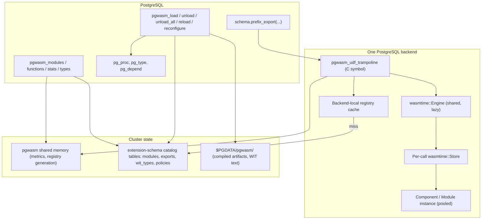
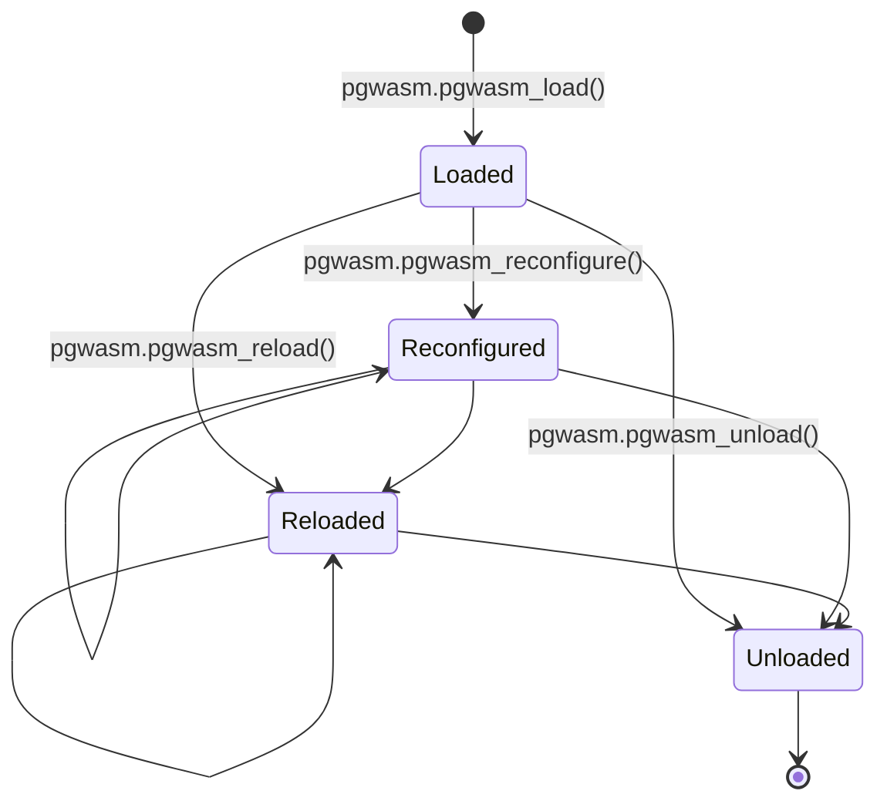
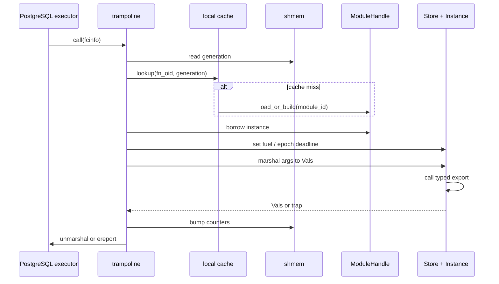

# pgwasm architecture

This document is the **v2 architectural design** for `pgwasm`, a PostgreSQL
extension that binds WebAssembly modules and components to SQL-visible
functions. It is written for engineers contributing to the extension and for
operators who need to reason about isolation, resource control, and
introspection.

SQL objects live in the extension schema (`pgwasm` by default, from
`pgwasm.control`); configuration parameters keep the `pgwasm.*` prefix.

---

## 1. Goals and non-goals

### 1.1 Goals

- **Load WASM once, call many times.** Pay compilation and component
  instantiation cost at module-load time so that per-invocation cost is close
  to a native C UDF plus the cost of marshaling arguments.
- **First-class WIT / Component Model.** Components with WIT worlds are the
  primary surface. Complex types (records, variants, enums, flags, lists,
  options, results, tuples) are mapped to PostgreSQL types **automatically**,
  and user-defined WIT types are registered as PostgreSQL composite types
  (UDTs), domains, or enums as appropriate.
- **Core modules supported as a degraded path.** Non-component core modules
  still work, but only with the small set of primitive ABIs that can be
  inferred safely from the module's export signatures.
- **Strong, layered sandbox.** WASI and host capabilities are off by default.
  Administrators enable them through GUCs at extension scope; module loaders
  can further **narrow** (never broaden) those defaults per module.
- **Lifecycle in SQL.** `pgwasm.pgwasm_load`, `pgwasm.pgwasm_unload`, `pgwasm.pgwasm_unload_all`,
  `pgwasm.pgwasm_reload`, and `pgwasm.pgwasm_reconfigure` are first-class SQL functions.
  Administrative state is durable across PostgreSQL restarts.
- **Observability.** Per-module and per-function counters, timings, errors,
  and resource snapshots are visible through SQL views.

### 1.2 Explicit non-goals (for v2)

- **No Extism.** The v1 branch experimented with Extism; v2 intentionally
  targets a single runtime (Wasmtime) to avoid dual-wasmtime linkage and to
  focus WIT support in one place.
- **No in-shared-memory WASM linear memory.** Linear memory lives in the
  executing backend process; sharing guest memory across backends is
  explicitly out of scope.
- **No hot-patching individual exports.** Reload is the unit of change for a
  module's code; reconfigure is the unit of change for policy and limits.

---

## 2. High-level model


```mermaid
flowchart TB
  subgraph SQL["PostgreSQL"]
    API["pgwasm_load / unload / unload_all / reload / reconfigure"]
    UDF["schema.prefix_export(...)"]
    Views["pgwasm_modules / functions / stats / types"]
    Catalog["pg_proc, pg_type, pg_depend"]
  end

  subgraph BackendProcess["One PostgreSQL backend"]
    Tramp["pgwasm_udf_trampoline (C symbol)"]
    LocalReg["Backend-local registry cache"]
    Engine["wasmtime::Engine (shared, lazy)"]
    Store["Per-call wasmtime::Store"]
    Instance["Component / Module instance (pooled)"]
  end

  subgraph ClusterState["Cluster state"]
    Shmem["pgwasm shared memory (metrics, registry generation)"]
    CatalogTables["extension-schema catalog tables: modules, exports, wit_types, policies"]
    Fs["$PGDATA/pgwasm/ (compiled artifacts, WIT text)"]
  end

  API --> CatalogTables
  API --> Fs
  API --> Catalog
  UDF --> Tramp
  Tramp --> LocalReg
  LocalReg -->|miss| CatalogTables
  Tramp --> Engine
  Engine --> Store
  Store --> Instance
  Tramp --> Shmem
  Views --> CatalogTables
  Views --> Shmem
```

The key insights:

1. **One trampoline symbol** backs every `pg_proc` row created by `pgwasm`.
   The trampoline resolves `(module_id, export)` from `flinfo->fn_oid` and
   dispatches into the runtime.
2. **Persistent catalog + on-disk artifacts** make module identity durable.
   Backends rebuild their local runtime state from catalog tables and cached
   compiled artifacts on demand; nothing in the hot path reads from disk
   except on a cold backend or after a reload.
3. **Shared memory carries only what must be cluster-wide**: a generation
   counter for cache invalidation, per-module/per-function counters, and the
   high-water memory and CPU samples. Everything else is derived state.

---

## 3. Repository layout (current)

```text
pgwasm/
  Cargo.toml
  build.rs
  pgwasm.control
  sql/                               # versioned SQL: catalog DDL, upgrades
    pgwasm--0.1.0.sql
  wit/                               # host WIT (path for bindgen in runtime/host)
    host.wit
  src/
    lib.rs                           # pgrx entry points + _PG_init
    guc.rs                           # GUC definitions
    errors.rs                        # PgWasmError + conversions
    catalog.rs                       # durable cluster state (SPI + nested modules)
    artifacts.rs                     # $PGDATA/pgwasm/ layout and IO
    shmem.rs                         # shared-memory segment + metrics
    registry.rs                      # process-local fn_oid / module export cache
    config.rs                        # LoadOptions, PolicyOverrides, Limits
    policy.rs                        # resolve(GUCs, overrides) -> EffectivePolicy
    abi.rs                           # Component vs core classifier (wasmparser)
    wit/
      mod.rs
      signature.rs                   # export signature JSON for catalog / reload checks
      world.rs                       # parse WIT world / component types
      typing.rs                      # WIT type -> PgType resolver
      udt.rs                         # UDT / enum / domain registration
    runtime/
      mod.rs                         # epoch ticker, runtime init
      engine.rs                      # shared wasmtime::Engine factory
      component.rs                   # component compile + instantiate; StoreLimits; WASI/linker (see §6)
      core.rs                        # core-module compile + instantiate
      pool.rs                        # per-module instance pool
      host.rs                        # pgwasm:host imports (pgrx backend)
      host_stub.rs                   # host.rs replacement for host-only cargo test
    mapping/
      mod.rs
      scalars.rs                     # i32/i64/f32/f64/bool/string mappings
      composite.rs                   # record / tuple / variant / enum / flags
      list.rs                        # list<T> / bytea list marshaling helpers
    proc_reg.rs                      # ProcedureCreate / RemoveFunctionById
    trampoline.rs                    # pgwasm_udf_trampoline C entry point
    lifecycle/
      mod.rs
      load.rs
      unload.rs
      reload.rs
      reconfigure.rs
    hooks.rs                         # on_load / on_unload / on_reconfigure
    views.rs                         # SRF table functions
    sql_test_hooks.rs                # `pg_test` feature only: SQL hooks for regress/tests
  tests/fixtures/                    # guest components + core WAT for pg_regress
    components/
    core/
  tests/pg_regress/
    sql/...
    expected/...
tests/                               # workspace integration crate (optional)
  Cargo.toml
  src/lib.rs                         # tokio-postgres client tests
docs/
  architecture.md                    # this document
  guc.md
  wit-mapping.md
```

**Possible refactors (not the layout today):** split `catalog.rs` / `registry.rs`
into subdirectories; add `wit/codegen.rs` or `mapping/jsonb.rs` if marshaling
grows; carve `runtime/limits.rs` or `runtime/wasi.rs` out of `component.rs` /
`mod.rs` if those surfaces need isolation.

Everything under `src/runtime/` and `src/wit/` is **Wasmtime-specific in v2**;
see **§6** for behavior. A second runtime, if added, would likely live under
`runtime/<name>/` behind a feature flag; a shared `Runtime` trait is **not**
implemented in the tree yet.

---

## 4. Durable state (catalog + artifacts)

### 4.1 Catalog tables

All state that must survive PostgreSQL restarts lives in regular PostgreSQL
tables created in the extension's schema (`pgwasm`). These tables are owned
by the extension and participate in `DROP EXTENSION ... CASCADE` cleanup.

| Table | Columns (abridged) | Purpose |
|-------|--------------------|---------|
| `pgwasm.modules` | `module_id bigserial pk`, `name text unique`, `abi text`, `digest bytea`, `wasm_sha256 bytea`, `origin text`, `artifact_path text`, `wit_world text`, `policy jsonb`, `limits jsonb`, `created_at`, `updated_at`, `generation bigint` | One row per loaded module. `digest` / `wasm_sha256` both capture the loaded bytes fingerprint (see loader); `origin` records how the module was loaded; `wit_world` stores textual WIT; `policy` / `limits` hold module-scoped overrides. |
| `pgwasm.exports` | `export_id bigserial pk`, `module_id fk`, `wasm_name text`, `sql_name text`, `signature jsonb`, `arg_types oid[]`, `ret_type oid`, `fn_oid oid`, `kind text` | One row per SQL-visible export. `signature` is normalized metadata for reload compatibility; `arg_types` / `ret_type` mirror the registered `pg_proc` signature. |
| `pgwasm.wit_types` | `wit_type_id bigserial pk`, `module_id fk`, `wit_name text`, `pg_type_oid oid`, `kind text` (e.g. `scalar`, `domain`, `array`, `composite`, `enum`, `variant`), `definition jsonb` | One row per registered PostgreSQL type. The `wit_name` column stores the stable **type key** (`package:interface/name` style) from `wit::typing`, not only a short WIT label. |
| `pgwasm.dependencies` | `module_id fk`, `depends_on_module_id fk` | Reserved for cross-module WIT type reuse (see §6.3). |

All tables are regular (not unlogged, not temporary): we want WAL coverage so
that replication reproduces the extension state.

### 4.2 On-disk artifacts

Compiled artifacts and the original WASM bytes live under
`$PGDATA/pgwasm/<module_id>/`:

- `module.wasm` — original bytes (for reload-from-catalog and auditing).
- `module.cwasm` — Wasmtime AOT-precompiled artifact
  (`Engine::precompile_component` / `Engine::precompile_module`). Regenerated
  on PostgreSQL upgrade or Wasmtime upgrade if `Engine::is_compatible_with_*`
  rejects the cached file.
- `world.wit` — textual WIT world (pretty-printed) for operator inspection
  and diff.

A backend that sees a `modules` row but no artifact for its process arch
lazily recompiles from `module.wasm` under a per-module load lock. The
extension never trusts catalog rows without a matching checksum on disk.

### 4.3 Shared memory

`pgwasm` requests a fixed-size shared memory segment in
`shmem_request_hook`. It holds:

- A `u64` **generation counter**. `load`, `unload`, `reload`, and
  `reconfigure` bump the generation under an `LWLock`. Backends compare their
  local cache generation on entry to the trampoline; on mismatch they refresh
  the specific affected module.
- A flat array of **per-export counters** (invocations, errors, `total_ns`,
  rejected_by_policy, OOM, traps) indexed by export slot order. Counters are
  `AtomicU64`. Today the `total_ns` slot is reused to accumulate **fuel units
  consumed** when `pgwasm.fuel_enabled` is on (not wall-clock nanoseconds).
- Per-module gauge fields may be added over time; the hot path focuses on
  export-level counters.

The segment is sized by fixed compile-time constants in `shmem.rs`
(`SHMEM_MODULE_SLOTS = 256`, `SHMEM_EXPORT_SLOTS = 4096`). If more modules
than capacity are loaded, the
excess gets dynamic (non-shared) counters and `pgwasm.pgwasm_stats()` reports
`shared := false` for those rows; this is a degraded mode, not an error.

---

## 5. Module lifecycle


```mermaid
stateDiagram-v2
  [*] --> Loaded: pgwasm.pgwasm_load()
  Loaded --> Reconfigured: pgwasm.pgwasm_reconfigure()
  Reconfigured --> Reconfigured
  Loaded --> Reloaded: pgwasm.pgwasm_reload()
  Reconfigured --> Reloaded
  Reloaded --> Reloaded
  Loaded --> Unloaded: pgwasm.pgwasm_unload()
  Reconfigured --> Unloaded
  Reloaded --> Unloaded
  Unloaded --> [*]
```

### 5.1 `pgwasm.pgwasm_load(module_name, bytes_or_path, options)`

Implemented in `lifecycle/load.rs` and exposed as `pgwasm.pgwasm_load` (see
`lib.rs` `sql_api`). All lifecycle functions return `boolean` (`true` on
success).

```sql
pgwasm.pgwasm_load(module_name text, bytes_or_path json, options json default null) returns boolean
```

`bytes_or_path` must be a JSON **object** with exactly one of:

- `"bytes": <bytea>` — WASM bytes inline.
- `"path": <text>` — filesystem path (requires `pgwasm.allow_load_from_file`).

Path loads use `pgwasm.module_path` as the base for relative paths,
`pgwasm.allowed_path_prefixes`, `pgwasm.follow_symlinks`, and
`pgwasm.max_module_bytes` the same way as the Rust loader documents in-code.

`module_name` is the durable catalog key (and SQL identifier prefix); it must
be non-empty and must not already exist unless reload is used.

Steps (high level; SPI transaction with abort cleanup on failure):

1. **AuthZ.** Superuser or member of `pgwasm_loader`; `pgwasm.enabled` must be on.
2. **Read bytes** as above; enforce size limits.
3. **Validate / classify.** `wasmparser` validation, then `abi::detect` (`Component` vs `Core`;
   optional `options.abi` forces core parsing only).
4. **WIT / types / exports.** Decode the world (`wit::world`), plan types (`wit::typing`),
   register UDTs (`wit::udt`), plan exports, and register `pg_proc` rows via `proc_reg`.
   SQL-visible function names are `'<module_name>' || '__' || <sanitized-export-key>` (see
   `lifecycle/load.rs`).
5. **Policy.** `policy::resolve` merges GUCs with module JSON (`config::LoadOptions`).
6. **Compile / artifacts.** Precompile to `$PGDATA/pgwasm/<module_id>/` and populate catalog rows.
7. **Hooks.** World export `on-load` runs when present.
8. **Generation bump** after commit (see unload for post-commit ordering).

### 5.2 `pgwasm.pgwasm_unload(module_name, cascade)`

```sql
pgwasm.pgwasm_unload(module_name text, cascade boolean default false) returns boolean
```

Tears down catalog `pg_proc` entries, `pgwasm.exports` / `wit_types` / `modules` rows,
and schedules post-commit artifact deletion and shmem slot frees. If another row in
`pgwasm.dependencies` references this module, unload fails unless `cascade = true`.

### 5.3 `pgwasm.pgwasm_unload_all()`

```sql
pgwasm.pgwasm_unload_all() returns bigint
```

Unloads every module (implementation iterates catalog). Intended for tests and
operators; requires the same loader role / superuser as other mutations.

### 5.4 `pgwasm.pgwasm_reload(module_name, bytes_or_path, options)`

```sql
pgwasm.pgwasm_reload(module_name text, bytes_or_path json, options json default null) returns boolean
```

`bytes_or_path` uses the same JSON shape as load. Reload preserves stable identities
when signatures and type definitions match (`lifecycle/reload.rs` + `wit::signature`);
breaking changes can be gated by load options (for example
`breaking_changes_allowed` in the JSON options model).

### 5.5 `pgwasm.pgwasm_reconfigure(module_name, policy, limits)`

```sql
pgwasm.pgwasm_reconfigure(
  module_name text,
  policy json default null,
  limits json default null
) returns boolean
```

Merges new JSON fragments into the module's stored `policy` / `limits`, resolves
effective policy, optionally calls the guest `on-reconfigure` export, and bumps
generation. Does not re-read WASM bytes.

Per-invocation limits (memory pages, fuel budget, epoch deadline) are read when each
`Store` is configured; `pgwasm.epoch_tick_ms` is sampled **once** when the epoch ticker
thread starts (`runtime::init`), so changing that GUC requires a **new backend
process** to change tick granularity.

---

## 6. Runtime layer (Wasmtime)

### 6.1 Engine

The workspace pins **Wasmtime 44** (see root `Cargo.toml` and
`errors::DEFAULT_WASMTIME_VERSION`). A single `wasmtime::Engine` per backend is
built lazily in `runtime/engine.rs` (`try_shared_engine` / `OnceLock`).

`runtime/engine.rs::configure_engine` sets:

- `Config::wasm_component_model(true)` — required for components.
- `Config::epoch_interruption(true)` — epoch deadlines per invocation
  (`Store::set_epoch_deadline` in the trampoline).
- `Config::consume_fuel(true)` — **always enabled** on the shared engine so
  `Store::set_fuel` / `Store::get_fuel` are always valid. When
  `pgwasm.fuel_enabled` is off, the trampoline seeds `u64::MAX` fuel so metering
  is effectively a no-op; when on, it applies `fuel_per_invocation` and records
  the delta in shared memory (see §4.3).
- `Config::cache(None::<Cache>)` — Wasmtime's compilation cache is disabled;
  pgwasm keeps its own `.cwasm` under `$PGDATA/pgwasm/`.
- `Config::parallel_compilation(false)` — predictable compile cost under
  PostgreSQL's process model.

Invocation stays **synchronous** (`component::Func::call` with `Val` buffers in
`mapping/composite.rs`).

Other settings we deliberately leave at their defaults: `wasm_backtrace`
(on; useful for error reports), `native_unwind_info` (on), SIMD, bulk
memory, reference types, multi-value, and the other stable proposals.

The engine is shared across all modules loaded into a single backend. A
dedicated OS thread drives `Engine::increment_epoch` at the tick interval read
**once** from `pgwasm.epoch_tick_ms` when `runtime::init` starts the ticker
(changing the GUC later does not reschedule the sleeper until a new process).
The thread holds an `EngineWeak` and exits when the engine is dropped.

### 6.2 Compile and cache

Compilation happens in `pgwasm.pgwasm_load`. The resulting `Component` (or
`Module`) is stored in two places:

1. **Process-local** pools and handles (`runtime/pool.rs`, `runtime/component.rs`)
   keep compiled `Component` / `Module` values hot; `registry::FN_OID_MAP` caches
   trampoline dispatch metadata by `pg_proc` OID.
2. **On disk** at `$PGDATA/pgwasm/<module_id>/module.cwasm` via
   `Engine::precompile_component` (or `Engine::precompile_module` for core
   modules), so cold backends can deserialize via
   `unsafe { Component::deserialize_file(&engine, &cwasm_path) }`
   (or `Module::deserialize_file`) without re-running the compiler. Both
   `deserialize*` entry points are `unsafe`; we document the
   invariants (trusted directory owned by the Postgres user, file content
   produced by the same-versioned Wasmtime) and enforce them in
   `artifacts.rs`.

Artifact compatibility across Wasmtime and Postgres upgrades is verified
with `Engine::precompile_compatibility_hash`, whose output is stored
alongside the `.cwasm` file. When the stored hash does not match the
current engine's, we delete the stale `.cwasm` and recompile from
`module.wasm`. `Engine::detect_precompiled_file` is used as a cheap sanity
check before ever calling `deserialize_file`.

A backend that attaches to an already-loaded module for the first time goes
through `load_handle_from_disk(module_id)`, which holds a per-module
`LWLock` to prevent stampedes.

### 6.3 Linker composition

For components, v2 uses `wasmtime::component::Linker`. WASI is wired in
through `wasmtime_wasi::p2::add_to_linker_sync` (preview-2 lives under the
`p2` module in Wasmtime 44). Per-store WASI state is
built with `wasmtime_wasi::WasiCtxBuilder`, produces a `WasiCtx`, and is
exposed to the linker through an implementation of `wasmtime_wasi::WasiView`
(which returns a `WasiCtxView { ctx, table }`). HTTP, when enabled, is
wired via `wasmtime_wasi_http::p2::add_to_linker_sync` with a companion
`WasiHttpCtx` and `WasiHttpView` implementation.

| Import | Source (Wasmtime 44) | Controlled by |
|--------|--------------|---------------|
| `wasi:cli/*`, `wasi:io/*`, `wasi:clocks/*`, `wasi:random/*`, `wasi:filesystem/*`, `wasi:sockets/*` | `wasmtime_wasi::p2::add_to_linker_sync` + `WasiCtxBuilder` | `pgwasm.allow_wasi_*` GUCs; filesystem preopens via `WasiCtxBuilder::preopened_dir`; sockets gated on `pgwasm.allow_wasi_net`/`allowed_hosts` |
| `wasi:http/*` | `wasmtime_wasi_http::p2::add_to_linker_sync` | `pgwasm.allow_wasi_http` |
| `pgwasm:host/log`, `pgwasm:host/query` | implemented in-process via `Linker::root().func_wrap(...)` | always on (subject to policy) |

If a capability GUC is off, we skip the corresponding `add_to_linker_sync`
call, which makes guest imports for that interface fail at instantiate time
with a clear "unknown import" error rather than silently no-op'ing. For
finer-grained subsetting, the per-interface `add_to_linker` functions on
generated bindings (e.g. `wasmtime_wasi::p2::bindings::filesystem::types::add_to_linker`)
can be used to opt into individual interfaces without opting into the
whole `wasi:cli/imports` world.

The `pgwasm:host/query` interface lets a module issue SPI queries back into
the executing backend (subject to `pgwasm.allow_spi` and the caller's
current role). This is how a WASM UDF can read related rows during its call.

### 6.4 Instance pool

Each `ModuleHandle` owns a small bounded instance pool. The intuition: WIT
components are cheap to **instantiate** once compiled, but not free (we pay
for `ResourceTable` initialization and host-state copies). For hot exports
(scalar functions, small records), we amortize by reusing instances across
invocations **within a single backend**, drawn from a pool sized by
`pgwasm.instances_per_module` (default 1).

Each call sequence:

1. Borrow an instance from the pool (or construct one if the pool is under
   the limit). If all instances are in use *and* the pool is at capacity, a
   fresh one is constructed and dropped after the call (degraded path).
2. Create a fresh `Store<HostState>` (`wasmtime::Store::new(&engine, ..)`).
   Configure it with `StoreLimits` built from `EffectivePolicy` via
   `StoreLimitsBuilder` and attached with `Store::limiter`; set the per-call
   fuel budget with `Store::set_fuel` (when fuel is enabled); and set the
   epoch deadline with `Store::set_epoch_deadline` (ticks computed from
   `pgwasm.invocation_deadline_ms / pgwasm.epoch_tick_ms`).
3. Invoke the typed export. For the dynamic path we use
   `wasmtime::component::Func::call(&mut store, &params, &mut results)`
   with slices of `component::Val`. (A `bindgen!` / `TypedFunc` fast path is
   conceivable but the production trampoline uses the dynamic `Val` path.)
4. Update metrics; return the instance to the pool.

Instances are rebuilt on every generation bump for the owning module.

### 6.5 Core modules

Core modules use `wasmtime::Module`, a `wasmtime::Linker<HostState>`, and
plain `Instance`. Exports are restricted to the primitive ABI (scalars and
`(ptr,len)` pairs for `text`/`bytea`/`jsonb`, like v1). Core modules do not
participate in the UDT registration machinery — their SQL signatures come
from `options.exports` hints.

This path exists for pre-component tooling; most new development should use
the component path.

---

## 7. Policy and GUCs

### 7.1 GUCs

All GUCs are declared in `guc.rs` and registered in `_PG_init`. Names below
are `pgwasm.*`.

| GUC | Kind | Default | Notes |
|-----|------|---------|-------|
| `enabled` | bool | `on` | Global kill switch; disables load and invocation. |
| `allow_load_from_file` | bool | `off` | Path-based load. |
| `module_path` | string | `''` | Root for relative paths on load. |
| `allowed_path_prefixes` | string | `''` | Comma-separated; canonicalized paths must fall under one. |
| `follow_symlinks` | bool | `off` | When `off`, path loads reject symlink components in canonicalization. |
| `max_module_bytes` | int | `33554432` | 32 MiB cap on WASM size. |
| `allow_wasi` | bool | `off` | Master WASI toggle; required for any `allow_wasi_*`. |
| `allow_wasi_stdio` | bool | `off` | stdout/stderr inheritance. |
| `allow_wasi_env` | bool | `off` | Environment variable inheritance. |
| `allow_wasi_fs` | bool | `off` | Filesystem preopens. |
| `wasi_preopens` | string | `''` | `guest=host` pairs, comma-separated. |
| `allow_wasi_net` | bool | `off` | TCP/UDP sockets. |
| `allowed_hosts` | string | `''` | `host:port` CIDR-ish list. |
| `allow_wasi_http` | bool | `off` | `wasi:http` imports. |
| `allow_spi` | bool | `off` | Expose `pgwasm:host/query`. |
| `max_memory_pages` | int | `1024` | 64 MiB per instance. |
| `max_instances_total` | int | `0` | `0` = unbounded process-wide. |
| `instances_per_module` | int | `1` | Size of the per-backend per-module instance pool (§6.4). |
| `fuel_enabled` | bool | `off` | When on, the trampoline applies a finite per-call fuel budget via `Store::set_fuel`. |
| `fuel_per_invocation` | int | `100_000_000` | Only used when `fuel_enabled` is on. |
| `invocation_deadline_ms` | int | `5000` | Epoch-based wall-clock cap; `0` = disabled. |
| `epoch_tick_ms` | int | `10` | Ticker interval read at `runtime::init` (process lifetime for that backend). |
| `collect_metrics` | bool | `on` | Registered for future use; counters are always updated on the hot path today. |
| `log_level` | enum | `notice` | Verbosity of load/unload/reload events. |

Shared-memory slot counts are fixed constants in `shmem.rs`
(`SHMEM_MODULE_SLOTS = 256`, `SHMEM_EXPORT_SLOTS = 4096`) rather than GUCs.
Overflow still degrades to non-shared counters with `shared := false`.

All `allow_*` GUCs default to **off**. The extension is useless without
flipping them — that is intentional.

### 7.2 Per-module overrides

`pgwasm.pgwasm_load` / `pgwasm.pgwasm_reload` accept a JSON `options` object
(parsed in `lifecycle/load.rs::parse_load_options`):

```json
{
  "abi": "component",
  "breaking_changes_allowed": false,
  "cascade": false,
  "limits": {
    "max_memory_pages": 256,
    "fuel_per_invocation": 10000000,
    "invocation_deadline_ms": 1000,
    "instances_per_module": 2
  },
  "overrides": {
    "allow_wasi_net": false,
    "allowed_hosts": ["db.example.com:443"]
  },
  "replace_exports": false
}
```

`pgwasm.pgwasm_reconfigure(module_name, policy, limits)` merges JSON objects into the
catalog row's `policy` / `limits` columns (see `lifecycle/reconfigure.rs`); keys mirror
`PolicyOverrides` / `Limits` in `config.rs`.

**Narrowing rule.** `policy::resolve(gucs, overrides)` intersects boolean allow-flags and
takes the stricter numeric caps. Module JSON cannot enable capabilities the GUCs deny.

### 7.3 Sandbox surfaces

- **Memory:** `StoreLimits` caps linear memory pages and table sizes.
- **CPU (time):** epoch interruption with `invocation_deadline_ms`; returns a
  SQL-visible `query cancelled` error without leaving the instance in an
  undefined state (Wasmtime guarantees this).
- **CPU (work):** optional fuel consumption for deterministic limits in tests
  or batch workloads.
- **FS / net / env:** WASI context only gets what policy allows. We
  explicitly do **not** let guests call `wasi:filesystem/preopens.get-
  directories` and receive a handle unless the operator configured one.
- **Imports outside WASI:** any component import not satisfied by our linker
  fails instantiation at load time — modules cannot smuggle unexpected host
  calls past the policy layer.

---

## 8. Type mapping and UDT registration

This is the largest change from v1.

### 8.1 WIT → PG type resolver

`wit::typing` defines `PgType` as the canonical destination and implements
`wit_to_pg(&Resolve, Type) -> Result<PgType, Error>` on top of
`wit_parser::{Resolve, Type, TypeDef, TypeDefKind}` (from the v0.247
`wit-parser` crate). The `Resolve` and the starting `WorldId` come from
`wit_component::decode(&wasm_bytes)` — a `wit_component::DecodedWasm` in
v0.247 has two variants, `WitPackage(Resolve, Id<Package>)` and
`Component(Resolve, Id<World>)`; components always land in the latter
arm. Named types go through `Resolve.types[TypeId]` to get a
`wit_parser::TypeDef` whose `kind` drives the mapping below. `wit-parser`'s
v0.247 vocabulary (records = `TypeDefKind::Record(Record)`, enums =
`Enum`, flags = `Flags`, variants = `Variant`, results = `Result_`,
resources via `TypeDefKind::Resource` / `Handle`) is used directly instead
of an internal duplicate.

| WIT type | PostgreSQL representation |
|----------|---------------------------|
| `bool` | `boolean` |
| `s8`, `s16` | `smallint` |
| `s32` | `integer` |
| `s64` | `bigint` |
| `u8` | `smallint` domain `pgwasm.m<id>_u8` with `CHECK (VALUE BETWEEN 0 AND 255)` |
| `u16` | `integer` domain `pgwasm.m<id>_u16` with `CHECK (VALUE BETWEEN 0 AND 65535)` |
| `u32` | `bigint` domain `pgwasm.m<id>_u32` with `CHECK (VALUE BETWEEN 0 AND 4294967295)` |
| `u64` | `numeric` domain `pgwasm.m<id>_u64` with `CHECK (VALUE BETWEEN 0 AND 18446744073709551615)` |
| `f32`, `f64` | `real`, `double precision` |
| `char` | `text` domain `pgwasm.m<id>_char` with `CHECK (char_length(VALUE) = 1)` |
| `string`, `error-context` | `text` |
| `list<u8>` | `bytea` |
| `list<T>` | `pgwasm.m<id>_*[]` domain (`NOT NULL` array) over the mapped element type |
| `option<T>` | same underlying PG type as `T`, nullable at the call boundary |
| `result<T, E>` | composite `(ok, err)`; missing `ok` / `err` arms use PostgreSQL `void` internally but composite columns use placeholder rules in `wit::udt` |
| `tuple<…>` | composite `CREATE TYPE pgwasm.m<id>_<sanitized_wit_name> AS (f0 …, f1 …)` |
| `record { … }` | composite with WIT field names (same naming scheme) |
| `variant { … }` | composite `(discriminant text, payload jsonb)` — see §8.2 |
| `enum { … }` | PostgreSQL `ENUM` |
| `flags { … }` | `integer` domain with `CHECK` bounding the bit width; bit order is documented from WIT |
| `resource`, `handle` | `bigint` (`int8`) |
| `map`, fixed-size list, `future`, `stream` | `jsonb` domain `pgwasm.m<id>_*_json` |

Stable **type keys** (`package:interface/name`) are produced by
`wit::typing::build_type_key` and stored in `pgwasm.wit_types.wit_name` for
reload matching.

SQL **type identifiers** created by `wit::udt` are always
`pgwasm.m<module_id>_<suffix>` where `suffix` is derived from the WIT name or
domain alias (see `type_sql_ident`).

### 8.2 UDT registration

`wit::udt::register_type_plan` runs DDL via SPI during load:

- Composites / enums / variants / array domains / scalar domains as required by the table above.
- Variants intentionally use only `(discriminant text, payload jsonb)` because PostgreSQL
  rejects `void` columns and the marshaller always emits two attributes.
- Nested composites inside record fields are still **unsupported** at the SQL DDL layer
  (`pg_type_sql` returns `Unsupported` for composite/enum/variant field types); stick to
  scalars, domains, and arrays of scalars inside records until that wiring lands.

Type OIDs are persisted in `pgwasm.wit_types`. Reload compares `definition` JSON to decide
whether an OID can be kept (`wit::udt::transition_or_create`).

### 8.3 Marshal / unmarshal

`mapping::composite` implements the dynamic `wasmtime::component::Val` ↔ `Datum` path used by
the trampoline for user-loaded components. There is no separate compile-time `bindgen!` world
checked into this repository for guest modules.

Escape hatch: components may still import `pgwasm:host/json` to exchange `jsonb` blobs for
shapes that are awkward to model as strict UDTs.

### 8.4 Polymorphism and generics

WIT is monomorphic at the world boundary, which simplifies the mapping.
However, component authors can publish multiple exports that differ only in
type — we surface each as a distinct PG function via the usual overloading
mechanism (`pg_proc.proargtypes` differ). Name conflicts inside one WIT
world are rejected at load time.

### 8.5 Operator and author references

Two companion documents extract the operational surface of this design
into flat reference tables:

- [`docs/guc.md`](guc.md) — every `pgwasm.*` GUC with its type, default,
  `GucContext` scope, and hot/cold reconfiguration semantics. Use it as
  the authoritative cheatsheet for `postgresql.conf` and
  `ALTER SYSTEM SET` work.
- [`docs/wit-mapping.md`](wit-mapping.md) — the canonical WIT →
  PostgreSQL type table (this section, expanded) with a WIT fragment, the
  DDL `pgwasm.pgwasm_load` issues, and a sample `SELECT` for every primitive,
  composite, generic, and resource kind.

---

## 9. Trampoline and invocation


```mermaid
sequenceDiagram
  participant PG as PostgreSQL executor
  participant Tr as trampoline
  participant Cache as local cache
  participant Shmem as shmem
  participant Handle as ModuleHandle
  participant Store as Store + Instance

  PG->>Tr: call(fcinfo)
  Tr->>Shmem: read generation
  Tr->>Cache: lookup(fn_oid, generation)
  alt cache miss
    Cache->>Handle: load_or_build(module_id)
  end
  Tr->>Handle: borrow instance
  Tr->>Store: set fuel / epoch deadline
  Tr->>Store: marshal args to Vals
  Store->>Store: call typed export
  Store-->>Tr: Vals or trap
  Tr->>Shmem: bump counters
  Tr->>PG: unmarshal or ereport
```

Notable properties:

- **Error mapping**: the trampoline converts Wasmtime traps into SQLSTATE-aware
  `PgWasmError` values with module and export context in DETAIL.
- **Interrupt handling**: Postgres query cancellation sets a flag the epoch
  ticker thread observes; the next `Engine::increment_epoch` tick causes
  the running call to terminate with `wasmtime::Trap::Interrupt` (the
  default action configured by `Store::epoch_deadline_trap`). The
  `map_wasmtime_err` classifies `Trap::Interrupt` as `PgWasmError::Timeout`
  (`ERRCODE_QUERY_CANCELED`) and `Trap::OutOfFuel` as
  `PgWasmError::ResourceLimitExceeded` (`ERRCODE_PROGRAM_LIMIT_EXCEEDED`). Other
  traps become `PgWasmError::Trap` (`ERRCODE_EXTERNAL_ROUTINE_EXCEPTION`).
- **Volatility**: component exports are currently registered as volatile /
  parallel-unsafe in `lifecycle/load.rs` (`proc_spec_for_function`); there is
  no per-export volatility override in the JSON options yet.

---

## 10. Metrics and views

SRFs in `views.rs` (wrapped as `pgwasm_*` in `lib.rs`) expose catalog + shmem data.
Thin SQL views (`*_view`) are created in extension SQL for `GRANT` ergonomics.

| Function | Columns (abridged) |
|----------|--------------------|
| `pgwasm.pgwasm_modules()` | `module_id`, `name`, `origin`, `digest`, `loaded_at` (`updated_at`), `policy_json`, `limits_json`, `shared` |
| `pgwasm.pgwasm_functions()` | `module_name`, `export_name` (WIT wasm export key), `fn_oid`, `arg_types`, `ret_type`, `abi`, `last_seen_generation` |
| `pgwasm.pgwasm_wit_types()` | `module_name`, `type_key` (`module_name::` + catalog `wit_name`), `kind`, `pg_type_oid`, `last_seen_generation` |
| `pgwasm.pgwasm_policy_effective()` | `module_name`, `policy_json`, `limits_json` (resolved `EffectivePolicy` as JSON) |
| `pgwasm.pgwasm_stats()` | `module_name`, `export_name`, `invocations`, `traps` (shmem field exists; not incremented on the main trampoline path today), `fuel_used_total` (fuel units when metering is on; stored in the `total_ns` shmem slot), `last_invocation_at` (reserved / currently `NULL`), `shared` |

Full detail lives in `pgwasm.exports` / `pgwasm.modules` catalog tables; the SRFs are a stable,
joined reporting surface.

---

## 11. Error model

`PgWasmError` (`errors.rs`) maps to PostgreSQL SQLSTATEs via `PgWasmError::sqlstate()`:

| Variant | SQLSTATE (typical) | Notes |
|---------|--------------------|-------|
| `Disabled` | `55000` object_not_in_prerequisite_state | `pgwasm.enabled = off`. |
| `PermissionDenied` | `42501` insufficient_privilege | AuthZ / policy. |
| `InvalidConfiguration` | `22023` invalid_parameter_value | Includes dependency / cascade errors on unload. |
| `InvalidModule` | `22P03` invalid_binary_representation | Bad WIT shape, planner errors, etc. |
| `NotFound` | `42704` undefined_object | Unknown module name. |
| `ResourceLimitExceeded` | `54000` program_limit_exceeded | Size caps, fuel exhaustion (`Trap::OutOfFuel`). |
| `Timeout` | `57014` query_canceled | Epoch / interrupt traps. |
| `ValidationFailed` | `22P03` invalid_binary_representation | Host-side validation. |
| `Trap { kind }` | `38000` external_routine_exception | Other Wasm traps. |
| `BreakingChangeReload` | `22023` invalid_parameter_value | Reload refused. |
| `ModuleAlreadyLoaded` | `22023` invalid_parameter_value | Duplicate `module_name` on load. |
| `Io` | `58030` io_error | Filesystem failures. |
| `Unsupported` | `0A000` feature_not_supported | Missing marshaller / DDL support. |
| `Internal` | `XX000` internal_error | Catch-all for invariant violations. |

`IntoReport` attaches `ErrorContext` (module id, export index, Wasmtime version) in `DETAIL`.

---

## 12. Concurrency and isolation

- **Within a backend**, the runtime is single-threaded; the trampoline holds
  the relevant pool slot for the duration of the call.
- **Across backends**, each has its own `Engine`, compiled cache, and
  instance pool. Compilation output on disk is shared but immutable per
  `<module_id, wasmtime_version>` tuple.
- **Catalog mutations** (load/unload/reload/reconfigure) take an exclusive
  `LWLock` (`pgwasm.CatalogLock`) around shmem generation bumps and SPI DDL.
  Concurrent loads are serialized; concurrent invocations are not.
- **Reload ordering**: an in-flight invocation of the old bytes completes
  against the old `ModuleHandle`; subsequent invocations use the new one
  after the generation bump. There is no "in-call" swap.

---

## 13. Security posture

- **Superuser or `pgwasm_loader`** required for all mutation APIs (`load`,
  `unload`, `unload_all`, `reload`, `reconfigure`). The role is not a member of
  `pg_catalog` and receives EXECUTE grants from extension SQL.
- **`CREATE EXTENSION`** runs the role DDL; `DROP EXTENSION` revokes.
- **Input validation** before Wasmtime: magic bytes, size caps, full
  `wasmparser::validate`.
- **Deny-by-default WASI.** Even with `allow_wasi = on`, each individual
  capability (`fs`, `net`, `http`, `env`, `stdio`) is its own toggle.
- **Path policy.** Absolute paths are canonicalized, symlinks rejected
  unless `pgwasm.follow_symlinks = on`, and the final path must sit under a
  configured prefix.
- **No dynamic linking.** We do not expose `dlopen`-like capabilities to
  guests; components declare their imports statically and we either satisfy
  them from the allow-list or refuse to instantiate.
- **Metrics disclosure.** `pgwasm.pgwasm_stats()` is readable by the
  `pgwasm_reader` role (GRANTed by the extension SQL); other catalog views
  are world-readable because they leak nothing beyond what `pg_proc` already
  exposes.

---

## 14. Testing strategy

Matches the three-layer model in `AGENTS.md`:

- **pg_regress** (`pgwasm/tests/pg_regress/`) — deterministic golden SQL for:
  lifecycle (`load → call → reconfigure → reload → unload`), each WIT type
  mapping (records, enums, variants, lists), policy narrowing, error classes.
  Fixtures live under `pgwasm/tests/fixtures/core/` (`.wat` / prebuilt `.wasm`)
  and `pgwasm/tests/fixtures/components/` (WIT guests).
- **In-backend unit tests** (`#[pg_test]` inside `pgwasm/src/**`) — exercise
  `policy::resolve`, `wit::typing`, `registry` cache coherence with
  generation bumps, trampoline error paths. Run with
  `cargo pgrx test -p pgwasm`.
- **Host-only unit tests** (`#[test]`) — pure Rust only. Cover `abi::detect`,
  `mapping::scalars`, GUC parsing of list values, path policy. Never call
  pgrx symbols that assume a loaded backend.
- **Integration tests** (workspace `tests/`) — a separate crate using
  `tokio-postgres` exercising concurrent backends, restart persistence, and
  failure recovery (kill a backend mid-call).

Fixtures:

- A canonical **components-first** corpus: `arith.component.wasm`,
  `strings.component.wasm`, `records.component.wasm`,
  `enums.component.wasm`, `variants.component.wasm`,
  `policy_probe.component.wasm`, `hooks.component.wasm`.
- A small **core-module** corpus for the degraded path: `add_i32.wat`,
  `echo_mem.wat`.

---

## 15. Build features

`pgwasm/Cargo.toml` currently defaults to `pg17` and keeps the component
model always enabled. The earlier `component-model` / `core-only` feature split
was closed without implementation; v2 remains Wasmtime-only with both component
and degraded core paths compiled.

No `runtime-extism`, no `runtime-wasmer`: v2 is Wasmtime-only.

---

## 16. Observability beyond views

- `RAISE NOTICE` at each lifecycle event, gated by `pgwasm.log_level`.
- Optional integration with `log_destination = jsonlog` by embedding the
  `module_id`, `export_id`, and `wasmtime_version` in every error.
- Counters exported to shared memory are consumable by `pg_stat_*` scraping
  tools through the `pgwasm.pgwasm_stats()` view; no external dependency is
  required.

---

## 17. Migration and upgrade

- **PostgreSQL upgrade (`pg_upgrade`).** Catalog tables and artifacts survive
  intact; on first backend connect after upgrade, artifacts are recompiled
  into `.cwasm` if the stored `Engine::precompile_compatibility_hash` does
  not match the current engine's. That hash — recorded alongside each
  `module.cwasm` when it is written — is the officially supported way in
  pinned Wasmtime releases (see workspace `Cargo.toml`) to gate deserialization
  across engine versions. If the hash
  matches, we still run `Engine::detect_precompiled_file` as a cheap
  sanity check before the `unsafe` `Component::deserialize_file` /
  `Module::deserialize_file` call. Row-level state (counters in shared
  memory) is re-initialized.
- **Extension upgrade.** `sql/pgwasm--X.Y--X.Z.sql` files carry DDL
  migrations. `catalog::migrations` asserts table shape at `_PG_init`.
- **Wasmtime upgrade.** Same artifact-recompile flow as `pg_upgrade`.

---

## 18. Open questions (tracked, not blockers)

- Should we expose a `pgwasm.attach(path)` that points at an
  externally-built `.cwasm` directly, bypassing compilation? (Useful in
  read-replica / CDN scenarios.)
- Do we want a per-backend **LRU eviction** of `ModuleHandle`s under memory
  pressure, or is "explicit unload only" sufficient?
- Is `wasi:keyvalue` worth implementing as a host-side shim over `SPI` for
  small-state use cases?

---

## 19. Summary

v2 `pgwasm` is a **Wasmtime + Component Model**-centric extension. Loaded
modules are durable catalog objects with on-disk compiled artifacts; each
exposes WIT-typed exports as SQL functions with automatically registered
UDTs. A shared runtime and instance pool per backend keep per-call overhead
low. A layered GUC + per-module policy model enforces strict,
narrow-by-default sandboxing. Metrics and catalog views make every loaded
module introspectable without external tooling.
